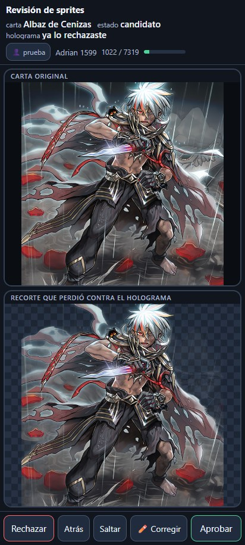
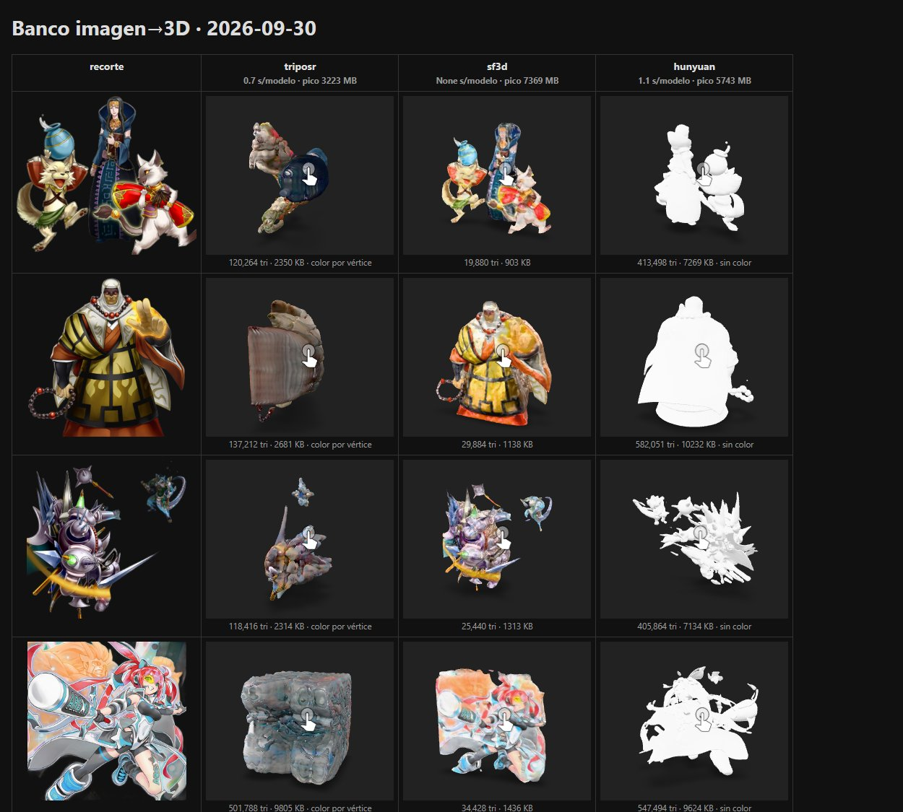

# Yu-Gi-Oh! AR: motor de duelo en realidad aumentada, en tiempo real

*[English version](README.md)*

Reconocimiento de cartas físicas de Yu-Gi-Oh! con una cámara y una PC, en
código abierto. Detecta las cartas sobre la mesa, las identifica en cinco
idiomas (inglés, español, alemán, francés y portugués), las sigue entre
fotogramas y dibuja el monstruo sobre el vídeo. La meta es un **motor de duelo
en AR** que funcione en vivo, con hardware normal y sin depender de la nube.


**Estado, 2 de octubre de 2026:** prototipo funcional de un duelo AR sobre una
mesa real. La cámara reconoce las cartas en todo el catálogo (unas 14,800), la
vista de duelo dibuja zonas, puntos de vida y fases sobre el vídeo, y
monstruos, magias y trampas tienen efectos propios de entrada, ataque y
destrucción. Las cartas boca abajo se detectan con cualquier funda sin enseñar
nada, y un escudo del Milenio girando marca a los defensores boca abajo. Las
cartas que el arte no resuelve (Ghost Rare, reflejos) se nombran por su título
impreso. El motor de duelo trabaja como notario: registra las jugadas y avisa
de problemas de reglas en lugar de bloquearlas. Las cartas sin sprite hecho a
mano reciben un recorte automático, que las personas revisan en tableta o
teléfono, y ya se compararon los primeros generadores de imagen a 3D. Con una
GPU NVIDIA (RTX 4070) un análisis con la mesa quieta tarda unos 44 ms (12 por
segundo); entre 1 y 4 segundos en el CPU de una laptop. Los detalles honestos
están en [Qué funciona hoy](#qué-funciona-hoy-y-qué-no).

Este proyecto necesita ayuda. Fotos de cartas reales, pruebas en otras cámaras
y computadoras, modelos 3D, código o documentación: todo cuenta. Ver
[Cómo ayudar](#cómo-ayudar) y [CONTRIBUTING.es.md](CONTRIBUTING.es.md).

## Índice

- [La idea](#la-idea)
- [Qué funciona hoy y qué no](#qué-funciona-hoy-y-qué-no)
- [Cómo funciona por dentro](#cómo-funciona-por-dentro)
- [Historia del proyecto](#historia-del-proyecto)
- [Capturas](#capturas)
- [Arrancarlo en tu PC](#arrancarlo-en-tu-pc)
- [Cómo ayudar](#cómo-ayudar)
- [Documentación de investigación](#documentación-de-investigación)
- [Datos, licencias y aviso legal](#datos-licencias-y-aviso-legal)
- [English summary](#english-summary)

## La idea

Dos personas juegan un duelo con cartas de verdad. Un teléfono o una webcam
mira la mesa. En una pantalla, o después en unas gafas, cada carta invocada
muestra su monstruo, y el sistema lleva la cuenta del duelo: qué hay en cada
zona, qué está boca abajo, qué se destruyó. Sin marcadores pegados a las
cartas, sin tapete especial, sin subir vídeo a ningún servidor.

Para llegar ahí hacen falta piezas que ya existen por separado y otras que no:

1. **Detección y geometría.** Encontrar cada carta en el fotograma y sus cuatro
   esquinas, aunque esté girada, en perspectiva o parcialmente tapada.
2. **Identificación.** Saber qué carta es. Por su ilustración, por su nombre
   impreso, por el passcode de ocho dígitos o por el código de set.
3. **Seguimiento.** Mantener la identidad de cada copia física mientras se
   mueve, y no inventarla cuando se pierde de vista.
4. **Catálogo.** Un registro local con todas las cartas, sus nombres en varios
   idiomas, sus impresiones y sus artes.
5. **Capa AR.** Dibujar sobre el vídeo lo que corresponde, alineado con la carta.
6. **Motor de duelo.** Zonas, fases, puntos de vida y jugadas, registradas a
   partir de lo que ve la cámara y confirmadas por los jugadores.

## Qué funciona hoy y qué no

Funciona, verificado con pruebas reproducibles en este repositorio:

- Detección de hasta 20 cartas orientadas por fotograma con un detector ONNX,
  y ajuste de esquinas por bordes cuando el rectángulo no encaja.
- Identificación por búsqueda de embeddings en el índice de referencias (el
  clasificador DRAW2 es el otro modo), con SIFT sobre el arte y el nombre
  impreso como segundos votos. El reconocedor SIFT de una sola referencia del
  primer prototipo se retiró el 2 de octubre de 2026.
- OCR local, sin red, del passcode, del nombre y del código de set, con
  consulta exacta al registro. No corrige caracteres a ciegas: una lectura
  dudosa se queda como dudosa.
- Seguimiento por instancia con confirmación en dos observaciones y
  distinción de dos copias iguales. Entre análisis, las esquinas se siguen
  con flujo óptico para que sprites y nombres se muevan con la carta a la
  velocidad del vídeo.
- Sprites AR 2D deformados en el navegador (WebGL) sobre las esquinas de la
  carta; el servidor sólo manda esquinas y un identificador de sprite.
- Aceptación por ilustración verificada: una carta que el embedding pone
  primera pero bajo el umbral (impresiones foil) se acepta cuando SIFT
  confirma su arte. Las pistas estables y recientes conservan su identidad
  sin volver a codificar.
- Fotogramas del stream MJPEG del teléfono, con sondeo de foto única como
  respaldo; inferencia ONNX en un proceso hijo que se mata y reinicia si se
  cuelga.
- Las fotos de tus propias cartas físicas se pueden inscribir como
  referencias adicionales.
- Registro multilingüe en SQLite: nombres EN/ES/DE/FR/PT, passcodes, códigos
  de set, rarezas y ediciones, con procedencia de cada dato.
- Visor web con cámara de teléfono por IP Webcam, coordinación entre pestañas
  y capturas guardadas para anotar.
- Vista de duelo conectada a la cámara (`/duel`): tapete imprimible con
  marcadores ArUco o tablero virtual ajustable, barra de fases, puntos de vida,
  ataques por clic o gesto, y jugadas deducidas de lo que aparece en la mesa
  (invocaciones Normal, por Sacrificio, Sincronía, Xyz, Enlace, Fusión y
  Ritual con sus materiales, colocar y voltear). El motor (`duel_engine.py`)
  lleva un registro de eventos con deshacer; en modo notario los problemas de
  reglas son avisos, no bloqueos.
- Cartas boca abajo con cualquier funda y sin enseñar: una Zona de Monstruo o
  de Magia/Trampa con una mancha con forma de carta en su centro que no es del
  color de la mesa, sin carta boca arriba detectada ahí, tiene una carta boca
  abajo; la orientación distingue defensa de carta colocada. El reverso
  oficial y las fundas enseñadas siguen sumando evidencia.
- El nombre impreso como segundo voto: cuando el arte solo es ambiguo (Ghost
  Rare, Starlight, reflejos), el OCR del título decide entre los cinco
  primeros candidatos visuales o, si se lee claro, en todo el registro (0
  cartas equivocadas en 1,885 lecturas erróneas simuladas).
- Efectos AR por tipo de carta (invocación, magia, trampa, colocar, ataque,
  destrucción, puntos de vida) con luz, partículas y sacudida; las entradas
  empiezan cuando la cámara ve llegar la carta.
- Sprites automáticos: recortes del arte con BiRefNet en la GPU (unos 0.45 s
  por carta) y un crítico que reintenta o rechaza los malos; unos 7,000
  generados hasta ahora.
- Ficha de la carta en la vista de duelo con categorías de efecto y el texto
  separado en costo, condición y efecto, tomadas de los scripts de EDOPro (el
  proyecto hermano `ygo-deckforge` construye esa tabla).
- Revisión humana de los recortes automáticos (`review_server.py`) en la PC,
  un iPad o un teléfono por la red de casa, con el dedo o el lápiz: aprobar,
  rechazar con motivo o corregir dibujando (refinado con SAM 2). Varias
  personas a la vez, cada carta para una sola, con veredictos contados por
  persona; los veredictos reentrenan al crítico de recortes.
- Banco de imagen a 3D (`tools/gen3d_bench.py`): TripoSR, Stable Fast 3D y
  Hunyuan3D-2mini sobre los mismos recortes aprobados. Stable Fast 3D da
  modelos con textura y ligeros (9 mil a 34 mil triángulos) en menos de un
  segundo cada uno.
- Todo el laboratorio arranca solo al iniciar sesión en la PC (una tarea de
  Windows corre `start_lab.ps1 -Live -Gpu -Full -Review`), cada servicio bajo
  un supervisor que lo reinicia.

No funciona todavía, o no está medido:

- **Velocidad.** Con una RTX 4070 la mesa quieta cuesta unos 44 ms por análisis
  (p50, 12 por segundo); una carta nueva, unos 165 ms (p90), porque se refinan
  sus esquinas y se codifica. En el CPU de una laptop, entre 1 y 4 segundos.
  Detalle en `research/TIEMPO_REAL.md`.
- **Precisión general.** Las pruebas usan pocas cartas reales. No hay cifras
  de acierto sobre un conjunto amplio, ni en los cinco idiomas, ni con fundas,
  brillos o rarezas distintas. El seguidor sólo se probó con fotogramas
  sintéticos.
- **Umbrales.** Los métodos ONNX aceptan o rechazan con umbrales
  experimentales; hay una calibración contra escaneos de TCGplayer en
  `research/CALIBRACION_ESCANEOS.md`.
- **3D y reglas.** Todavía no se dibuja ningún modelo 3D en la mesa (los
  generadores sólo se compararon en un banco) y no hay oclusión. Los efectos de
  cartas se muestran y clasifican, pero los resuelven los jugadores, no el
  motor. Aún no hay duelo remoto (el plan está en `research/DUELO_REMOTO.md`).
- **Cartas boca abajo.** Una funda del color de la mesa no se ve si no se
  enseña.
- **A dónde van las cartas.** Todavía no se sigue una carta que sale de su zona
  hacia el Cementerio, la mano o el mazo; la vista muestra lo que ve la cámara.
- **Hardware.** Probado en una laptop con gráficos Intel integrados y una PC
  con RTX 4070.

## Cómo funciona por dentro

```text
teléfono (IP Webcam) --JPEG--> camera_viewer.py --/snapshot--> navegador (web/camera.js)
                                     |
                                /analyze (una inferencia a la vez)
                                     |
                     vision_onnx.py: detector OBB -> rectificación -> identificación
                                     |
                     seguimiento por instancia -> pistas por fotograma (X-Tracks) -> sprites WebGL en el navegador
                                     |
                     passcode_ocr.py / name_ocr.py / set_ocr.py (cola aparte)
                                     |
                     card_evidence.py: fusión de evidencias visual + OCR + arte
                                     |
                     data/registry/registry.sqlite  <-  registry.py, build_catalog.py
```

Dónde está cada cosa: `settings.py` (rutas y entorno), `contracts.py` (qué
lleva una detección y una pista), `pipeline.py` (un análisis: reconocedor,
OCR, seguimiento, duelo), `camera_viewer.py` (sólo HTTP), `vision_onnx.py` con
`onnx_models.py`, `reference_index.py` y `promotions.py` (el reconocedor),
`card_backs.py` (cartas boca abajo), `table_duel.py` y `duel_engine.py` (el
duelo). `tools/` guarda los trabajos que se corren a mano (recortes, crítico,
banco 3D), `reference/` las entradas versionadas que lee el código, `reviews/`
los veredictos humanos y `research/` sólo estudios; el laboratorio no depende
de él. Índice de documentos: [docs/INDEX.md](docs/INDEX.md).

Principios que el código respeta y que conviene conservar:

- Una sola cosa posee la cámara. El navegador pide fotogramas al servidor; el
  análisis corre en otro bucle y nunca bloquea el vídeo.
- `card_id` (identidad del catálogo), `artwork_id` (ilustración) y `track_id`
  (copia física observada) son tres cosas distintas y se guardan separadas.
- El OCR no sobrescribe la identidad visual. Aporta evidencia; las
  ambigüedades y los conflictos se conservan y se muestran.
- Los datos regenerables (catálogo, índices) viven aparte de las decisiones
  humanas (revisiones, anotaciones). Se pueden reconstruir sin perder trabajo.
- Cada mejora tiene una prueba `qa_*.py`; su informe va a `.runtime/qa/` (no
  versionado), y `python run_qa.py --ci` corre las que no necesitan datos.

## Historia del proyecto

El repositorio tiene nueve días de vida intensa. Lo que sigue es la cronología
tal como quedó registrada en los documentos de `research/`.

### 24 de septiembre de 2026: revisión inicial

Se evaluaron cuatro repositorios de AR con cartas (TCG-AR, un juego de cartas
en AR, un identificador con OpenCV y un proyecto para HoloLens), además de
DRAW, DRAW2, Lowhur y Roboflow como detectores ya entrenados para Yu-Gi-Oh!.
Ninguno resolvía el problema completo; DRAW2 aportó un detector y un
clasificador ONNX utilizables en CPU. Se decidió construir una aplicación
pequeña en Python y OpenCV, con un catálogo local, antes de pensar en 3D.

El mismo día quedó el primer visor: un servidor en Python sin dependencias que
recibe JPEG de un teléfono Android con IP Webcam y los muestra en el navegador.
Sobre él, el primer reconocimiento: SIFT y homografía RANSAC sobre la
ilustración de Blue-Eyes White Dragon, verificado con dos fotos reales.

### 25 de septiembre de 2026: el piloto

Un día largo, documentado en [ENTREGA_PILOTO.md](research/ENTREGA_PILOTO.md)
y [TRANSFERENCIA_GENERAL.md](research/TRANSFERENCIA_GENERAL.md):

- **Catálogo unificado** desde YGOJSON, con 14,616 identidades y 40,187
  referencias de imagen, y una galería web para revisar y corregir enlaces.
- **Piloto de 50 cartas** con tres reconocedores comparados: SIFT, DRAW2 y
  embeddings del clasificador. Seguimiento con confirmación y sprites AR.
- **Registro multilingüe** con nombres, passcodes e impresiones en cinco
  idiomas, alimentado por un descargador de la base Neuron de Konami que
  reanuda tras apagados. Terminó con 67,552 fichas carta/idioma.
- **OCR local** de passcode, nombre y código de set con RapidOCR, más un
  ajuste geométrico de esquinas antes de recortar.
- **Arte recortado** de YGOPRODeck autoalojado, unos 1.4 GB, y verificación
  SIFT de candidatas como evidencia adicional.
- **Experimentos** que quedaron en cola para una PC con GPU: YOLO11 con
  cuatro esquinas, restauración de reflejos y aprendizaje contrastivo. Un
  benchmark de reflejos concluyó que los modelos probados no mejoraban la
  identificación en la muestra local.
- Se inicializó Git con el código, la web y la investigación dentro, y los
  datos pesados fuera.

### 26 de septiembre de 2026: TCGplayer y reparaciones

Descarga completa de los escaneos de TCGplayer para tener imágenes reales de
impresiones concretas: 47,824 productos y 46,058 escaneos. Un reinicio de la
máquina destruyó el manifiesto a medias; se reescribió con escritura durable y
copia de seguridad, y se reconstruyeron sin red los metadatos perdidos a partir
del sitemap y del registro. Un OCR por lotes lee los códigos de set en los
escaneos restantes, y sólo se aceptan los que el registro reconoce.

En paralelo, auditoría y reparación del registro, resolución de identidades
duplicadas y un catálogo de reconocimiento ampliado. Los documentos están en
[research/database-audit/](research/database-audit/).

Por la noche, el bucle en tiempo real sin GPU
([TIEMPO_REAL.md](research/TIEMPO_REAL.md)): seguimiento de esquinas entre
análisis, stream MJPEG, sprites deformados en el navegador, inferencia
aislada, aceptación por ilustración verificada, todos los artes en el piloto,
inscripción de cartas fotografiadas, un primer motor de duelo
([MOTOR_DE_DUELO.md](research/MOTOR_DE_DUELO.md)), un protocolo de capturas
([PROTOCOLO_CAPTURAS.md](research/PROTOCOLO_CAPTURAS.md)), calibración de
umbrales contra escaneos de TCGplayer e integración continua
([docs/CI.md](docs/CI.md)).

### 27 de septiembre de 2026: la PC con GPU y la vista de duelo

El proyecto pasó a una PC con RTX 4070 (`setup_gpu.ps1`,
[docs/ARRANQUE_GPU.md](docs/ARRANQUE_GPU.md)). El reconocimiento se abrió al
catálogo completo y apareció una vista de duelo aparte: tapete imprimible con
marcadores ArUco o tablero virtual sobre el vídeo, barra de fases, puntos de
vida, batalla por clic o gesto, tipos de invocación con materiales deducidos,
cartas boca abajo y volteo.

### 28 de septiembre de 2026: efectos, reversos y modo notario

El motor de duelo pasó a ser notario: los problemas de reglas quedan como
avisos en el registro y deciden los jugadores
([MOTOR_DE_DUELO.md](research/MOTOR_DE_DUELO.md); plan de duelo remoto en
[DUELO_REMOTO.md](research/DUELO_REMOTO.md)). La vista ahora sigue a la
cámara: las entradas se disparan cuando se ve llegar la carta y las figuras
boca abajo aparecen donde se ve un reverso. Nuevo hoy: motor de efectos por
tipo de carta, fundas enseñadas en cuatro orientaciones, el nombre impreso
como segundo voto para cartas Ghost Rare, recortes automáticos con BiRefNet y
un crítico, categorías de efecto y texto de costo/efecto desde los scripts de
EDOPro, y un escudo del Milenio que gira sobre los defensores boca abajo.

### 29 de septiembre al 2 de octubre de 2026: revisión, 3D, arquitectura

- **Revisión humana** de los recortes automáticos en el iPad y el teléfono, con
  el dedo o el lápiz, para varias personas a la vez; casi 4,000 veredictos en
  los primeros días. Los hologramas muestran el mejor recorte que perdió contra
  ellos.
- **Banco 3D** en esta PC: TripoSR (con un parche de marching cubes en CPU),
  Stable Fast 3D y Hunyuan3D-2mini compilados en Windows con CUDA 12.8 y
  comparados.
- **Velocidad:** el análisis pasa de 132 a 44 ms con la mesa quieta, el registro
  del duelo ya no se reproduce para la vista previa y el deshacer (700 a 17
  ms), y el OCR hace menos pasadas.
- **Reconocimiento:** una Naturia Barkion Ghost Rare que el arte no ubicaba se
  nombra por su título impreso, buscado en todo el registro.
- **Cartas boca abajo con cualquier funda** sin enseñar: una mancha con forma
  de carta que no es del color de la mesa.
- **Revisión de arquitectura** en tres fases: configuración y contratos en un
  solo lugar, el análisis fuera del servidor HTTP, el reconocedor dividido en
  cuatro módulos, el código de producción fuera de `research/`, pruebas que ya
  no escriben en el repositorio y retiro del reconocedor SIFT del primer
  prototipo.

## Capturas


28 de septiembre: la misma vista con otro mazo. Las cartas se reconocen en todo el catálogo y se etiquetan en español.

| | |
|---|---|
|  |  |
| El revisor de recortes en un teléfono: se desliza para aprobar o rechazar, o se corrige dibujando. | Banco de imagen a 3D: los mismos recortes en tres generadores; Stable Fast 3D conserva la textura. |


El escudo del Milenio gira despacio sobre los monstruos en defensa boca abajo.
El giro se calcula a partir de una vista de frente y una de reverso, con un
canto dorado en el perfil.


Efectos de invocación y ataque sobre una mesa sintética, cuadro por cuadro.

| | |
|---|---|
|  |  |
| Ficha de la carta en la vista de duelo: categorías desde los scripts de EDOPro y el texto separado en costo, objetivo, efecto y condición. | Recortes automáticos: el arte y cuatro modelos comparados. Se eligió BiRefNet, que corre en la GPU. |

| | |
|---|---|
|  |  |
| Sprite AR sobre una captura real, seguido entre análisis. Los objetos cortados por el borde reciben un aviso en rojo en lugar de una identidad adivinada. | Ficha de Dragón de Péndulo de Ojos Anómalos: nombres en cinco idiomas, tres artes y escaneos pendientes de revisión. |


La capa AR se dibuja en el navegador sobre el JPEG original. Guardar un
fotograma conserva la imagen sin superposición.

## Arrancarlo en tu PC

Probado en Windows 11 con Python 3.14. Los datos (`data/`, `downloads/`) no
están en Git; hay que generarlos o copiarlos. Sin ellos, el visor de cámara
sin reconocimiento sigue funcionando con Python solo.

```powershell
python -m venv .venv-eval
.\.venv-eval\Scripts\python.exe -m pip install -r requirements-research.txt
.\.venv-eval\Scripts\python.exe -m pip install -r requirements-ocr.txt
.\.venv-eval\Scripts\python.exe build_catalog.py      # catálogo desde YGOJSON
.\.venv-eval\Scripts\python.exe vision_onnx.py        # índice de vectores del piloto
.\start_lab.ps1                                       # galería, foto de prueba, registro
.\start_lab.ps1 -Live                                 # además, la cámara del teléfono
.\start_lab.ps1 -Live -Gpu -Full -Review              # GPU, catálogo completo, revisor de recortes
```

Servicios locales: cámara en http://127.0.0.1:8765, foto de prueba en
http://127.0.0.1:8767, galería en http://127.0.0.1:8768 y registro en
http://127.0.0.1:8769. El teléfono corre IP Webcam en la misma red; la IP se
cambia con `--camera`. Guía completa de instalación, traslado y verificación:
[ENTREGA_PILOTO.md](research/ENTREGA_PILOTO.md) y
[TRANSFERENCIA_GENERAL.md](research/TRANSFERENCIA_GENERAL.md).

Pruebas: cada `qa_*.py` en la raíz es una comprobación independiente. `python
run_qa.py --ci` corre las que pasan en un clon limpio (también en GitHub, ver
[docs/CI.md](docs/CI.md)); `python run_qa.py` las corre todas.

## Cómo ayudar

Cualquiera puede ayudar, y no hace falta saber programar. Lo que más falta
hoy, en orden:

1. **Fotos de cartas reales.** En español, inglés, alemán, francés y
   portugués; con fundas y sin fundas; con brillo, sombra, giro y varias cartas
   juntas. La página de capturas del proyecto permite marcar esquinas e
   identidad. Es la pieza que bloquea todo lo demás.
2. **Probar en otro hardware.** Otra webcam, otro teléfono, otra PC, una GPU.
   Contar qué pasó, con el JSON de `research/qa/`.
3. **Modelos 3D de monstruos** con licencia clara para reemplazar los sprites.
4. **Motor de reglas de duelo.** Zonas, fases, puntos de vida. Es una pieza
   independiente del reconocimiento y se puede empezar desde cero.
5. **Entrenamiento en GPU.** YOLO11 de cuatro esquinas con datos reales y
   ajuste contrastivo de los embeddings. Los experimentos ya están diseñados en
   [COLA_EXPERIMENTOS.md](research/COLA_EXPERIMENTOS.md).
6. **Revisar el catálogo.** La galería tiene miles de referencias propuestas
   que alguien tiene que aprobar o corregir.
7. **Documentación y traducciones.** Casi todo está en español; una versión en
   inglés ayudaría a que llegue más gente.

Abre un issue con lo que quieras hacer, o manda un pull request. Las reglas de
la casa están en [CONTRIBUTING.es.md](CONTRIBUTING.es.md). La más importante: cada
cambio dice qué se probó y qué no.

## Documentación de investigación

El directorio `research/` es el cuaderno del proyecto. Empieza por el índice,
[docs/INDEX.md](docs/INDEX.md), que separa los documentos vigentes de los
históricos. El plan actual es [PLAN_3D_Y_REVISION.md](research/PLAN_3D_Y_REVISION.md).
Entradas principales:

- [Estado consolidado y traslado a otra PC](research/TRANSFERENCIA_GENERAL.md)
- [Tiempo real sin GPU: seguimiento, stream, sprites, aislamiento](research/TIEMPO_REAL.md)
- [Motor de duelo](research/MOTOR_DE_DUELO.md) · [Protocolo de capturas con cartas reales](research/PROTOCOLO_CAPTURAS.md)
- [Calibración de aceptación y set code con escaneos de TCGplayer](research/CALIBRACION_ESCANEOS.md) · [CI](docs/CI.md)
- [Plan vigente: cámara variable, geometría, seguimiento y consultas](research/PLAN_MEJORA_INTEGRAL.md)
- [Plan de acción original y criterios de aceptación](research/PLAN_DE_ACCION.md)
- [Entrega del piloto: uso, resultados y reproducción](research/ENTREGA_PILOTO.md)
- [Pipeline de cámara: estado, correcciones y pruebas](research/PIPELINE_ESTADO.md)
- [Geometría de cartas](research/GEOMETRIA_CARTAS.md) · [Evidencia temporal](research/EVIDENCIA_TEMPORAL.md)
- [OCR del passcode](research/OCR_PASSCODE.md) · [OCR del nombre](research/OCR_NOMBRE.md)
- [Registro multilingüe](research/REGISTRO_MULTILINGUE.md) · [Auditoría de la base](research/database-audit/)
- [Arte de YGOPRODeck y verificación](research/ARTE_YGOPRODECK.md)
- [Escaneos de TCGplayer](research/TCGPLAYER_MUESTRA.md)
- [Reflejos: estado del arte](research/ESTADO_DEL_ARTE_REFLEJOS.md) y [benchmark](research/glare-benchmark/README.md)
- [YOLO11 de cuatro esquinas](research/yolo11_pose/README.md) · [Vectores e invariancia](research/PLAN_VECTORES_E_INVARIANCIA.md)
- [Evaluación de repositorios externos](research/REPOSITORIOS.md) · [Referencias adicionales](research/references-20260924/REVISION.md)
- [Cola de experimentos para una PC con GPU](research/COLA_EXPERIMENTOS.md)
- [Bitácora inicial: primer visor y primer SIFT](docs/BITACORA_INICIAL.md)

## Datos, licencias y aviso legal

- Yu-Gi-Oh! es una marca de Konami. Este es un proyecto de aficionados, sin
  afiliación con Konami ni con TCGplayer, YGOPRODeck o cualquier otra fuente.
- Las imágenes de cartas, escaneos y artes descargados son propiedad de sus
  titulares. Se usan localmente para investigación y **no se redistribuyen**:
  `data/` y `downloads/` están fuera de Git.
- El código de referencia de terceros en `repos/` conserva sus licencias.
  Cualquier trabajo derivado debe acompañarlas.
- El código de este repositorio se publica bajo la [licencia MIT](LICENSE).
  La licencia cubre el código y la documentación, no las imágenes de cartas
  ni los datos descargados de terceros.

## English summary

This repository is an open-source lab for recognizing physical Yu-Gi-Oh! cards
with a camera and a PC, and overlaying augmented-reality content on them in
real time. The long-term goal is an AR duel engine: no fiducial markers, no
special playmat, everything running locally.

What works today: an ONNX oriented-box detector, identification by embedding
search (with SIFT on the artwork and the printed name as second votes), local
OCR of the passcode, card name and set code with exact registry lookup,
per-instance tracking, and 2D AR sprites composited in the browser. The
multilingual registry (EN/ES/DE/FR/PT) lives in SQLite and was built from
YGOJSON, Konami's Neuron database and TCGplayer scans.

Since September 27 it also has a duel view over the live camera: phases,
life points, battle, inferred summons, face-down detection by card back,
per-type AR effects, automatic cut-out sprites and a notary-mode duel engine.
What does not work yet: calibrated accuracy on a broad real-card set, 3D
models, occlusion, resolving card effects, and remote duels.

Help wanted: photos of real cards in five languages, tests on other hardware,
3D monster models with clear licenses, a duel rules engine, GPU training, and
English documentation. See [CONTRIBUTING.md](CONTRIBUTING.md). Most documents
are in Spanish.
