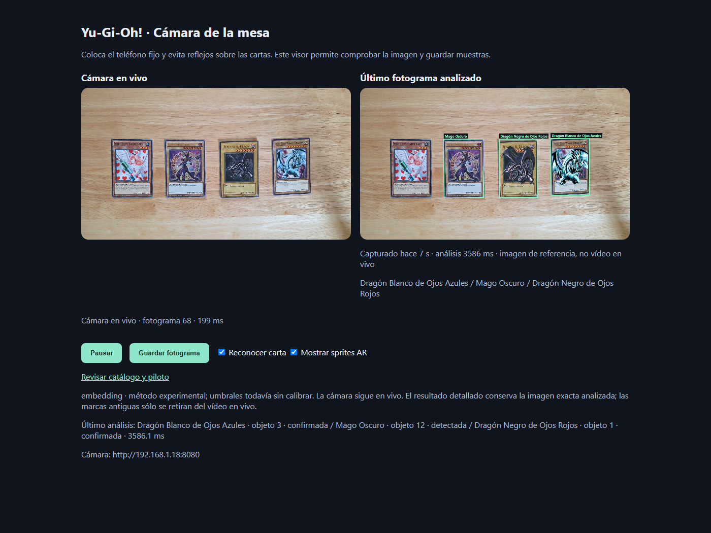
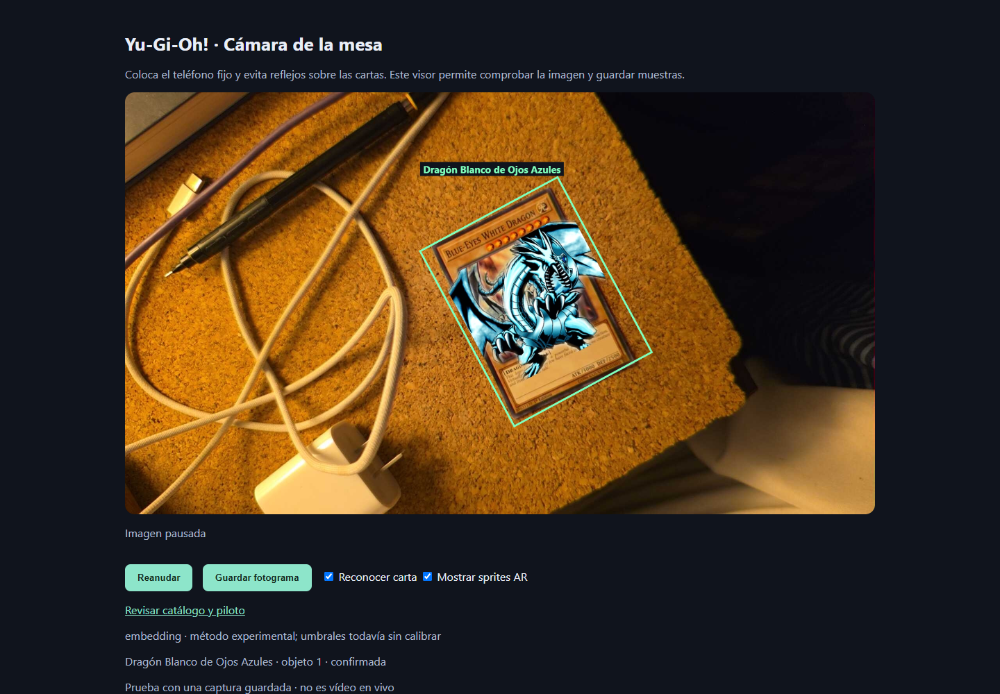
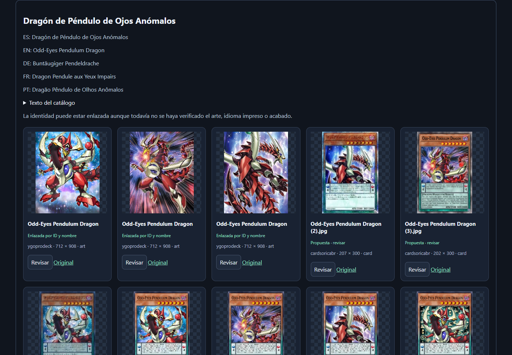
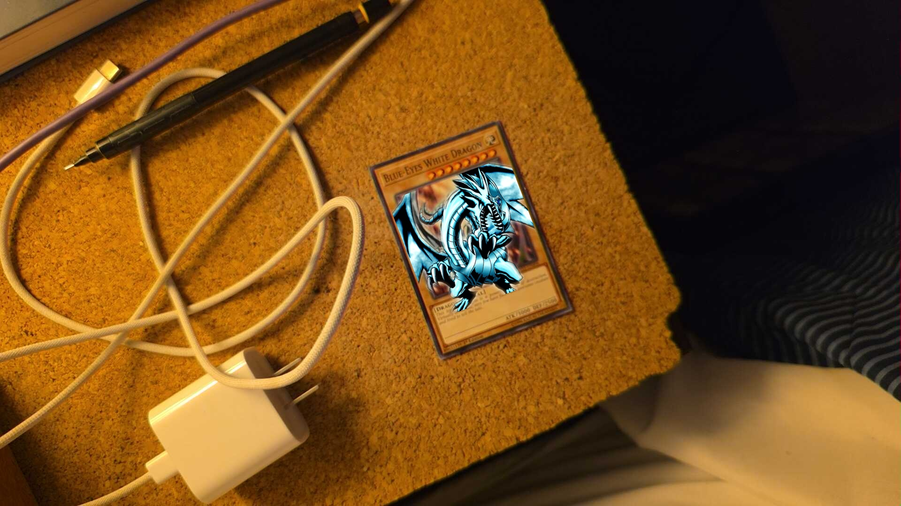

# Yu-Gi-Oh! AR: motor de duelo en realidad aumentada, en tiempo real

Reconocimiento de cartas físicas de Yu-Gi-Oh! con una cámara y una PC, en
código abierto. Detecta las cartas sobre la mesa, las identifica en cinco
idiomas (inglés, español, alemán, francés y portugués), las sigue entre
fotogramas y dibuja el monstruo sobre el vídeo. La meta es un **motor de duelo
en AR** que funcione en vivo, con hardware normal y sin depender de la nube.

*Yu-Gi-Oh! card recognition and augmented reality duel engine. Open source,
runs locally on CPU with OpenCV, ONNX Runtime and local OCR. Multilingual
catalog (EN/ES/DE/FR/PT). Work in progress; contributions welcome. See the
[English summary](#english-summary) at the end.*



**Estado, 26 de septiembre de 2026:** prototipo funcional. Reconoce varias
cartas a la vez en capturas y en vídeo desde un teléfono, con sprites 2D sobre
cada carta. Todavía no hay reglas de duelo, ni modelos 3D, ni la velocidad
objetivo de 5 análisis por segundo. Los detalles honestos están en
[Qué funciona hoy](#qué-funciona-hoy-y-qué-no).

Este proyecto necesita ayuda. Fotos de cartas reales, pruebas en otras cámaras
y computadoras, modelos 3D, código o documentación: todo cuenta. Ver
[Cómo ayudar](#cómo-ayudar) y [CONTRIBUTING.md](CONTRIBUTING.md).

## Índice

- [La idea](#la-idea)
- [Qué funciona hoy y qué no](#qué-funciona-hoy-y-qué-no)
- [Cómo funciona por dentro](#cómo-funciona-por-dentro)
- [Historia del proyecto](#historia-del-proyecto)
- [Capturas](#capturas)
- [Arrancarlo en tu PC](#arrancarlo-en-tu-pc)
- [Cómo ayudar](#cómo-ayudar)
- [Documentación de investigación](#documentación-de-investigación)
- [Datos, licencias y aviso legal](#datos-licencias-y-aviso-legal)
- [English summary](#english-summary)

## La idea

Dos personas juegan un duelo con cartas de verdad. Un teléfono o una webcam
mira la mesa. En una pantalla, o después en unas gafas, cada carta invocada
muestra su monstruo, y el sistema lleva la cuenta del duelo: qué hay en cada
zona, qué está boca abajo, qué se destruyó. Sin marcadores pegados a las
cartas, sin tapete especial, sin subir vídeo a ningún servidor.

Para llegar ahí hacen falta piezas que ya existen por separado y otras que no:

1. **Detección y geometría.** Encontrar cada carta en el fotograma y sus cuatro
   esquinas, aunque esté girada, en perspectiva o parcialmente tapada.
2. **Identificación.** Saber qué carta es. Por su ilustración, por su nombre
   impreso, por el passcode de ocho dígitos o por el código de set.
3. **Seguimiento.** Mantener la identidad de cada copia física mientras se
   mueve, y no inventarla cuando se pierde de vista.
4. **Catálogo.** Un registro local con todas las cartas, sus nombres en varios
   idiomas, sus impresiones y sus artes.
5. **Capa AR.** Dibujar sobre el vídeo lo que corresponde, alineado con la carta.
6. **Motor de duelo.** Zonas, fases, puntos de vida y reglas. Esta pieza aún
   no existe en el repositorio.

## Qué funciona hoy y qué no

Funciona, verificado con pruebas reproducibles en este repositorio:

- Detección de hasta 20 cartas orientadas por fotograma con un detector ONNX,
  y ajuste de esquinas por bordes cuando el rectángulo no encaja.
- Tres métodos de identificación intercambiables: SIFT sobre el arte,
  clasificador DRAW2 y búsqueda por embeddings. Los tres identificaron las
  capturas reales de prueba y rechazaron una imagen vacía.
- OCR local, sin red, del passcode, del nombre y del código de set, con
  consulta exacta al registro. No corrige caracteres a ciegas: una lectura
  dudosa se queda como dudosa.
- Seguimiento por instancia con confirmación en dos observaciones y
  distinción de dos copias iguales.
- Sprites AR 2D proyectados sobre el plano de cada carta, compuestos en el
  navegador.
- Registro multilingüe en SQLite: nombres EN/ES/DE/FR/PT, passcodes, códigos
  de set, rarezas y ediciones, con procedencia de cada dato.
- Visor web con cámara de teléfono por IP Webcam, coordinación entre pestañas
  y capturas guardadas para anotar.

No funciona todavía, o no está medido:

- **Velocidad.** El vídeo va a unos 5 fotogramas por segundo y cada análisis
  tarda entre 1 y 4 segundos en CPU. La meta de 5 análisis por segundo y 25 FPS
  no se cumple.
- **Precisión general.** Las pruebas usan pocas cartas reales. No hay cifras
  de acierto sobre un conjunto amplio, ni en los cinco idiomas, ni con fundas,
  brillos o rarezas distintas.
- **Umbrales.** Los métodos ONNX aceptan o rechazan con umbrales
  experimentales, no calibrados.
- **3D y reglas.** No hay modelos 3D, ni oclusión, ni motor de duelo, ni
  multijugador.
- **GPU.** Todo se ha probado en una laptop con gráficos Intel integrados.

## Cómo funciona por dentro

```text
teléfono (IP Webcam) --JPEG--> camera_viewer.py --/snapshot--> navegador (web/camera.js)
                                     |
                                /analyze (una inferencia a la vez)
                                     |
                     vision_onnx.py: detector OBB -> rectificación -> identificación
                                     |
                     seguimiento por instancia -> capa AR (PNG transparente)
                                     |
                     passcode_ocr.py / name_ocr.py / set_ocr.py (cola aparte)
                                     |
                     card_evidence.py: fusión de evidencias visual + OCR + arte
                                     |
                     data/registry/registry.sqlite  <-  registry.py, build_catalog.py
```

Principios que el código respeta y que conviene conservar:

- Una sola cosa posee la cámara. El navegador pide fotogramas al servidor; el
  análisis corre en otro bucle y nunca bloquea el vídeo.
- `card_id` (identidad del catálogo), `artwork_id` (ilustración) y `track_id`
  (copia física observada) son tres cosas distintas y se guardan separadas.
- El OCR no sobrescribe la identidad visual. Aporta evidencia; las
  ambigüedades y los conflictos se conservan y se muestran.
- Los datos regenerables (catálogo, índices) viven aparte de las decisiones
  humanas (revisiones, anotaciones). Se pueden reconstruir sin perder trabajo.
- Cada mejora tiene una prueba `qa_*.py` y un informe JSON en `research/qa/`.

## Historia del proyecto

El repositorio tiene tres días de vida intensa. Lo que sigue es la cronología
tal como quedó registrada en los documentos de `research/`.

### 24 de septiembre de 2026: revisión inicial

Se evaluaron cuatro repositorios de AR con cartas (TCG-AR, un juego de cartas
en AR, un identificador con OpenCV y un proyecto para HoloLens), además de
DRAW, DRAW2, Lowhur y Roboflow como detectores ya entrenados para Yu-Gi-Oh!.
Ninguno resolvía el problema completo; DRAW2 aportó un detector y un
clasificador ONNX utilizables en CPU. Se decidió construir una aplicación
pequeña en Python y OpenCV, con un catálogo local, antes de pensar en 3D.

El mismo día quedó el primer visor: un servidor en Python sin dependencias que
recibe JPEG de un teléfono Android con IP Webcam y los muestra en el navegador.
Sobre él, el primer reconocimiento: SIFT y homografía RANSAC sobre la
ilustración de Blue-Eyes White Dragon, verificado con dos fotos reales.

### 25 de septiembre de 2026: el piloto

Un día largo, documentado en [ENTREGA_PILOTO.md](research/ENTREGA_PILOTO.md)
y [TRANSFERENCIA_GENERAL.md](research/TRANSFERENCIA_GENERAL.md):

- **Catálogo unificado** desde YGOJSON, con 14,616 identidades y 40,187
  referencias de imagen, y una galería web para revisar y corregir enlaces.
- **Piloto de 50 cartas** con tres reconocedores comparados: SIFT, DRAW2 y
  embeddings del clasificador. Seguimiento con confirmación y sprites AR.
- **Registro multilingüe** con nombres, passcodes e impresiones en cinco
  idiomas, alimentado por un descargador de la base Neuron de Konami que
  reanuda tras apagados. Terminó con 67,552 fichas carta/idioma.
- **OCR local** de passcode, nombre y código de set con RapidOCR, más un
  ajuste geométrico de esquinas antes de recortar.
- **Arte recortado** de YGOPRODeck autoalojado, unos 1.4 GB, y verificación
  SIFT de candidatas como evidencia adicional.
- **Experimentos** que quedaron en cola para una PC con GPU: YOLO11 con
  cuatro esquinas, restauración de reflejos y aprendizaje contrastivo. Un
  benchmark de reflejos concluyó que los modelos probados no mejoraban la
  identificación en la muestra local.
- Se inicializó Git con el código, la web y la investigación dentro, y los
  datos pesados fuera.

### 26 de septiembre de 2026: TCGplayer y reparaciones

Descarga completa de los escaneos de TCGplayer para tener imágenes reales de
impresiones concretas: 47,824 productos y 46,058 escaneos. Un reinicio de la
máquina destruyó el manifiesto a medias; se reescribió con escritura durable y
copia de seguridad, y se reconstruyeron sin red los metadatos perdidos a partir
del sitemap y del registro. Un OCR por lotes lee los códigos de set en los
escaneos restantes, y sólo se aceptan los que el registro reconoce.

En paralelo, auditoría y reparación del registro, resolución de identidades
duplicadas y un catálogo de reconocimiento ampliado. Los documentos están en
[research/database-audit/](research/database-audit/).

## Capturas

| | |
|---|---|
|  |  |
| Sprite AR sobre una captura real, con la carta girada. | Galería del catálogo: nombres en cinco idiomas y referencias de arte por revisar. |



La capa AR se dibuja en el navegador sobre el JPEG original. Guardar un
fotograma conserva la imagen sin superposición.

## Arrancarlo en tu PC

Probado en Windows 11 con Python 3.14. Los datos (`data/`, `downloads/`) no
están en Git; hay que generarlos o copiarlos. Sin ellos, el visor de cámara
sin reconocimiento sigue funcionando con Python solo.

```powershell
python -m venv .venv-eval
.\.venv-eval\Scripts\python.exe -m pip install -r requirements-research.txt
.\.venv-eval\Scripts\python.exe -m pip install -r requirements-ocr.txt
.\.venv-eval\Scripts\python.exe build_catalog.py      # catálogo desde YGOJSON
.\.venv-eval\Scripts\python.exe vision_onnx.py        # índice de vectores del piloto
.\start_lab.ps1                                       # galería, foto de prueba, registro
.\start_lab.ps1 -Live                                 # además, la cámara del teléfono
```

Servicios locales: cámara en http://127.0.0.1:8765, foto de prueba en
http://127.0.0.1:8767, galería en http://127.0.0.1:8768 y registro en
http://127.0.0.1:8769. El teléfono corre IP Webcam en la misma red; la IP se
cambia con `--camera`. Guía completa de instalación, traslado y verificación:
[ENTREGA_PILOTO.md](research/ENTREGA_PILOTO.md) y
[TRANSFERENCIA_GENERAL.md](research/TRANSFERENCIA_GENERAL.md).

Pruebas: cada `qa_*.py` en la raíz es una comprobación independiente. La lista
que se ejecuta antes de cada entrega está en
[PIPELINE_ESTADO.md](research/PIPELINE_ESTADO.md).

## Cómo ayudar

Cualquiera puede ayudar, y no hace falta saber programar. Lo que más falta
hoy, en orden:

1. **Fotos de cartas reales.** En español, inglés, alemán, francés y
   portugués; con fundas y sin fundas; con brillo, sombra, giro y varias cartas
   juntas. La página de capturas del proyecto permite marcar esquinas e
   identidad. Es la pieza que bloquea todo lo demás.
2. **Probar en otro hardware.** Otra webcam, otro teléfono, otra PC, una GPU.
   Contar qué pasó, con el JSON de `research/qa/`.
3. **Modelos 3D de monstruos** con licencia clara para reemplazar los sprites.
4. **Motor de reglas de duelo.** Zonas, fases, puntos de vida. Es una pieza
   independiente del reconocimiento y se puede empezar desde cero.
5. **Entrenamiento en GPU.** YOLO11 de cuatro esquinas con datos reales y
   ajuste contrastivo de los embeddings. Los experimentos ya están diseñados en
   [COLA_EXPERIMENTOS.md](research/COLA_EXPERIMENTOS.md).
6. **Revisar el catálogo.** La galería tiene miles de referencias propuestas
   que alguien tiene que aprobar o corregir.
7. **Documentación y traducciones.** Casi todo está en español; una versión en
   inglés ayudaría a que llegue más gente.

Abre un issue con lo que quieras hacer, o manda un pull request. Las reglas de
la casa están en [CONTRIBUTING.md](CONTRIBUTING.md). La más importante: cada
cambio dice qué se probó y qué no.

## Documentación de investigación

El directorio `research/` es el cuaderno del proyecto. Entradas principales:

- [Estado consolidado y traslado a otra PC](research/TRANSFERENCIA_GENERAL.md)
- [Plan vigente: cámara variable, geometría, seguimiento y consultas](research/PLAN_MEJORA_INTEGRAL.md)
- [Plan de acción original y criterios de aceptación](research/PLAN_DE_ACCION.md)
- [Entrega del piloto: uso, resultados y reproducción](research/ENTREGA_PILOTO.md)
- [Pipeline de cámara: estado, correcciones y pruebas](research/PIPELINE_ESTADO.md)
- [Geometría de cartas](research/GEOMETRIA_CARTAS.md) · [Evidencia temporal](research/EVIDENCIA_TEMPORAL.md)
- [OCR del passcode](research/OCR_PASSCODE.md) · [OCR del nombre](research/OCR_NOMBRE.md)
- [Registro multilingüe](research/REGISTRO_MULTILINGUE.md) · [Auditoría de la base](research/database-audit/)
- [Arte de YGOPRODeck y verificación](research/ARTE_YGOPRODECK.md)
- [Escaneos de TCGplayer](research/TCGPLAYER_MUESTRA.md)
- [Reflejos: estado del arte](research/ESTADO_DEL_ARTE_REFLEJOS.md) y [benchmark](research/glare-benchmark/README.md)
- [YOLO11 de cuatro esquinas](research/yolo11_pose/README.md) · [Vectores e invariancia](research/PLAN_VECTORES_E_INVARIANCIA.md)
- [Evaluación de repositorios externos](research/REPOSITORIOS.md) · [Referencias adicionales](research/references-20260924/REVISION.md)
- [Cola de experimentos para una PC con GPU](research/COLA_EXPERIMENTOS.md)
- [Bitácora inicial: primer visor y primer SIFT](docs/BITACORA_INICIAL.md)

## Datos, licencias y aviso legal

- Yu-Gi-Oh! es una marca de Konami. Este es un proyecto de aficionados, sin
  afiliación con Konami ni con TCGplayer, YGOPRODeck o cualquier otra fuente.
- Las imágenes de cartas, escaneos y artes descargados son propiedad de sus
  titulares. Se usan localmente para investigación y **no se redistribuyen**:
  `data/` y `downloads/` están fuera de Git.
- El código de referencia de terceros en `repos/` conserva sus licencias.
  Cualquier trabajo derivado debe acompañarlas.
- El código de este repositorio se publica bajo la [licencia MIT](LICENSE).
  La licencia cubre el código y la documentación, no las imágenes de cartas
  ni los datos descargados de terceros.

## English summary

This repository is an open-source lab for recognizing physical Yu-Gi-Oh! cards
with a camera and a PC, and overlaying augmented-reality content on them in
real time. The long-term goal is an AR duel engine: no fiducial markers, no
special playmat, everything running locally.

What works today: an ONNX oriented-box detector, three interchangeable
identifiers (SIFT on artwork, the DRAW2 classifier, and embedding search), local
OCR of the passcode, card name and set code with exact registry lookup,
per-instance tracking, and 2D AR sprites composited in the browser. The
multilingual registry (EN/ES/DE/FR/PT) lives in SQLite and was built from
YGOJSON, Konami's Neuron database and TCGplayer scans.

What does not work yet: real-time speed (analysis takes 1 to 4 s on CPU),
calibrated accuracy on a broad real-card set, 3D models, occlusion, and duel
rules. Everything has been tested on one laptop with integrated graphics.

Help wanted: photos of real cards in five languages, tests on other hardware,
3D monster models with clear licenses, a duel rules engine, GPU training, and
English documentation. See [CONTRIBUTING.md](CONTRIBUTING.md). Most documents
are in Spanish.
