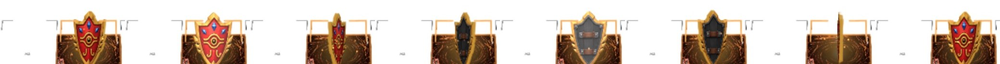
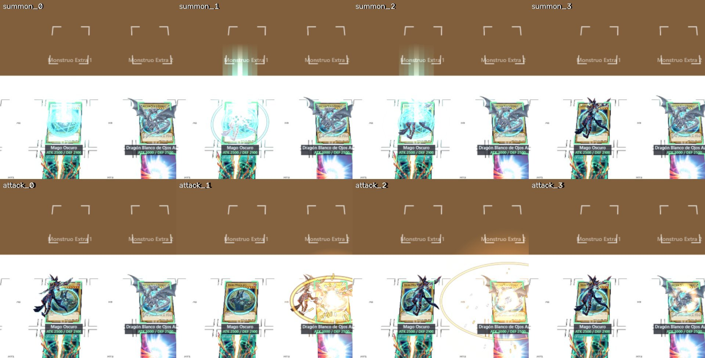
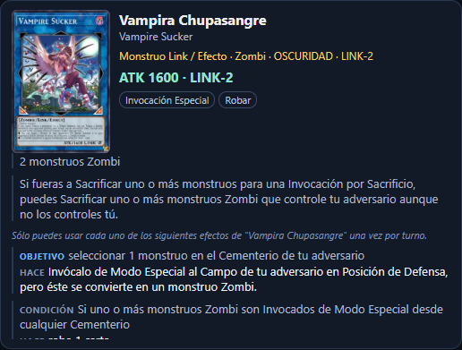
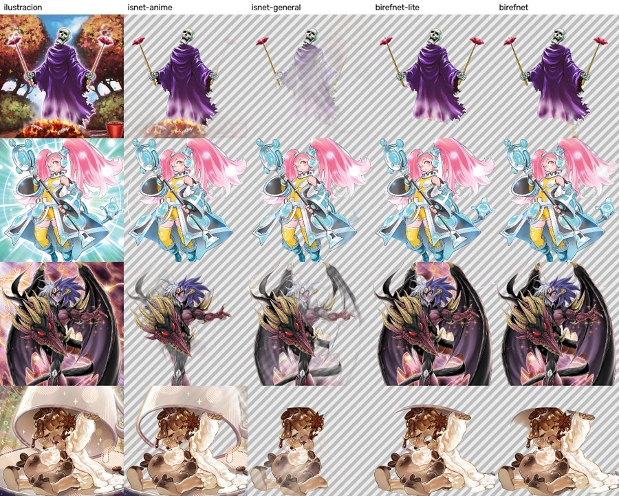

# Yu-Gi-Oh! AR: a real-time augmented reality duel engine

*[Versión en español](README.es.md)*

Open-source recognition of physical Yu-Gi-Oh! cards with a camera and a PC.
It finds the cards on the table, identifies them in five languages (English,
Spanish, German, French and Portuguese), tracks them across frames and draws
the monster over the video. The goal is an **AR duel engine** that runs live,
on ordinary hardware, with nothing sent to the cloud.


**Status, September 28, 2026:** working prototype of an AR duel on a real
table. The camera recognizes the cards across the full catalog (about 14,800
cards), the duel view draws the zones, life points and phases over the video,
and monsters, spells and traps get their own entrance, attack and destruction
effects. Face-down cards are detected by their back, including sleeves the
player teaches, and a spinning Millennium shield marks face-down defenders.
The duel engine works as a notary: it records plays and warns about rule
problems instead of blocking. Cards without a hand-made sprite get an
automatic cut-out. A full analysis takes about 0.2 s live with an NVIDIA GPU
(RTX 4070) and 1 to 4 seconds on a laptop CPU. The honest details are in
[What works today and what does not](#what-works-today-and-what-does-not).

This project needs help. Photos of real cards, tests on other cameras and
computers, 3D models, code or documentation: everything counts. See
[How to help](#how-to-help) and [CONTRIBUTING.md](CONTRIBUTING.md).

## Contents

- [The idea](#the-idea)
- [What works today and what does not](#what-works-today-and-what-does-not)
- [How it works inside](#how-it-works-inside)
- [Project history](#project-history)
- [Screenshots](#screenshots)
- [Running it on your PC](#running-it-on-your-pc)
- [How to help](#how-to-help)
- [Research documentation](#research-documentation)
- [Data, licenses and legal notice](#data-licenses-and-legal-notice)
- [Resumen en español](#resumen-en-español)

## The idea

Two people play a duel with real cards. A phone or a webcam looks at the
table. On a screen, or later in a pair of glasses, every summoned card shows
its monster, and the system keeps track of the duel: what is in each zone,
what is face down, what was destroyed. No markers glued to the cards, no
special playmat, no video uploaded anywhere.

Getting there takes pieces that already exist separately and others that do
not exist yet:

1. **Detection and geometry.** Find every card in the frame and its four
   corners, even when rotated, in perspective or partly covered.
2. **Identification.** Know which card it is: by its artwork, by the printed
   name, by the eight-digit passcode or by the set code.
3. **Tracking.** Keep the identity of each physical copy while it moves, and
   never make it up when it goes out of view.
4. **Catalog.** A local registry with every card, its names in several
   languages, its printings and its artworks.
5. **AR layer.** Draw over the video whatever belongs there, aligned to the card.
6. **Duel engine.** Zones, phases, life points and plays, recorded from what
   the camera sees and confirmed by the players.

## What works today and what does not

Works, verified with reproducible tests in this repository:

- Detection of up to 20 oriented cards per frame with an ONNX detector, plus
  edge-based corner refinement when the rectangle does not fit.
- Three interchangeable identifiers: SIFT on the artwork, the DRAW2
  classifier, and embedding search. All three identified the real test
  captures and rejected an empty image.
- Local OCR, no network, of the passcode, the card name and the set code, with
  exact registry lookup. It never guesses characters: a doubtful read stays
  doubtful.
- Per-instance tracking with confirmation after two observations, and
  separation of two identical copies. Between analyses, corners are followed
  with optical flow so sprites and names move with the card at video rate.
- 2D AR sprites warped in the browser (WebGL) over the card's corners; the
  server only sends corners and a sprite id.
- Acceptance by verified illustration: a card the embedding ranks first but
  scores below threshold (foil printings) is accepted when SIFT matches its
  artwork. Fresh, stable tracks keep their identity without re-encoding.
- Frames from the phone's MJPEG stream, with single-shot polling as fallback;
  ONNX inference in a child process that is killed and restarted on a hang.
- Photographs of your own physical cards can be enrolled as extra references.
- A multilingual registry in SQLite: EN/ES/DE/FR/PT names, passcodes, set
  codes, rarities and editions, with the provenance of every value.
- A web viewer with a phone camera through IP Webcam, coordination between
  browser tabs, and saved captures for annotation.
- A duel view connected to the camera (`/duel`): a printable mat with ArUco
  markers or an adjustable virtual board, phase bar, life points, attacks by
  click or gesture, and plays inferred from what appears on the table
  (Normal, Tribute, Synchro, Xyz, Link, Fusion and Ritual summons with their
  materials, sets and flips). The engine (`duel_engine.py`) keeps an event log
  with undo; in notary mode rule problems become warnings, not blocks.
- Face-down detection by comparing each zone with card backs: the official
  back plus sleeves taught with one button, in four orientations.
- The printed name as a second vote: when the artwork alone is ambiguous
  (Ghost Rare, Starlight, glare), OCR of the title decides among the visual
  top five.
- AR effects per card type (summon, spell, trap, set, attack, destruction,
  life points) with light, particles and camera shake; entrances start when
  the camera sees the card arrive.
- Automatic sprites: BiRefNet cut-outs of the artwork on the GPU (about 0.45 s
  per card) with a critic that retries or rejects bad cut-outs; about 7,000
  generated so far.
- Card sheet in the duel view with effect categories and the text split into
  cost, condition and effect, taken from EDOPro card scripts (the sibling
  project `ygo-deckforge` builds that table).

Does not work yet, or has not been measured:

- **Speed.** With an RTX 4070 a live analysis of 12 cards takes about 0.2 s
  (p50; detector and encoder on the GPU, card geometry still on the CPU); on
  a laptop CPU, 1 to 4 seconds. Tracking hides it between analyses, but the
  first identification of a new card still waits that long. Details in
  `research/TIEMPO_REAL.md`.
- **General accuracy.** The tests use few real cards. There are no accuracy
  figures over a broad set, nor across the five languages, nor with sleeves,
  glare or different rarities. The tracker was tested on synthetic frames only.
- **Thresholds.** The ONNX methods accept or reject with experimental
  thresholds; a calibration against TCGplayer scans is documented in
  `research/CALIBRACION_ESCANEOS.md`.
- **3D and rules.** No 3D models and no occlusion. Card effects are shown and
  categorized, but the players resolve them; the engine does not. No remote
  duel yet (the plan is in `research/DUELO_REMOTO.md`).
- **Where cards go.** A card leaving a zone is not yet followed to the
  Graveyard, the hand or the deck; the view shows what the camera sees.
- **Hardware.** Tested on one laptop with integrated Intel graphics and one PC
  with an RTX 4070.

## How it works inside

```text
phone (IP Webcam) --JPEG--> camera_viewer.py --/snapshot--> browser (web/camera.js)
                                  |
                             /analyze (one inference at a time)
                                  |
                  vision_onnx.py: OBB detector -> rectification -> identification
                                  |
                  per-instance tracking -> per-frame tracks (X-Tracks) -> WebGL sprites in the browser
                                  |
                  passcode_ocr.py / name_ocr.py / set_ocr.py (separate queue)
                                  |
                  card_evidence.py: fusion of visual + OCR + artwork evidence
                                  |
                  data/registry/registry.sqlite  <-  registry.py, build_catalog.py
```

Principles the code follows and that are worth keeping:

- One component owns the camera. The browser asks the server for frames; the
  analysis runs in another loop and never blocks the video.
- `card_id` (catalog identity), `artwork_id` (illustration) and `track_id`
  (observed physical copy) are three different things and are stored apart.
- OCR does not overwrite the visual identity. It contributes evidence;
  ambiguities and conflicts are kept and shown.
- Regenerable data (catalog, indexes) lives apart from human decisions
  (reviews, annotations). Everything can be rebuilt without losing work.
- Every improvement has a `qa_*.py` test and a JSON report in `research/qa/`.

## Project history

The repository is five intense days old. What follows is the timeline as it
was recorded in the documents under `research/`.

### September 24, 2026: initial review

Four AR card repositories were evaluated (TCG-AR, an AR card game, an OpenCV
identifier and a HoloLens project), together with DRAW, DRAW2, Lowhur and
Roboflow as already-trained Yu-Gi-Oh! detectors. None solved the whole
problem; DRAW2 contributed an ONNX detector and classifier usable on CPU. The
decision was to build a small Python and OpenCV application with a local
catalog before thinking about 3D.

The first viewer landed the same day: a dependency-free Python server that
receives JPEG frames from an Android phone running IP Webcam and shows them in
the browser. On top of it, the first recognition: SIFT and RANSAC homography on
the Blue-Eyes White Dragon artwork, verified on two real photos.

### September 25, 2026: the pilot

A long day, documented in [ENTREGA_PILOTO.md](research/ENTREGA_PILOTO.md)
and [TRANSFERENCIA_GENERAL.md](research/TRANSFERENCIA_GENERAL.md):

- **Unified catalog** from YGOJSON, with 14,616 identities and 40,187 image
  references, and a web gallery to review and correct the links.
- **50-card pilot** with three recognizers compared: SIFT, DRAW2 and the
  classifier's embeddings. Tracking with confirmation and AR sprites.
- **Multilingual registry** with names, passcodes and printings in five
  languages, fed by a downloader of Konami's Neuron database that resumes after
  shutdowns. It ended with 67,552 card/language entries.
- **Local OCR** of passcode, name and set code with RapidOCR, plus geometric
  corner refinement before cropping.
- **Cropped artwork** from YGOPRODeck, self-hosted, about 1.4 GB, with SIFT
  verification of candidates as additional evidence.
- **Experiments** queued for a PC with a GPU: four-corner YOLO11, glare
  removal and contrastive learning. A glare benchmark concluded that the
  tested models did not improve identification on the local sample.
- Git was initialized with the code, the web files and the research inside,
  and the heavy data outside.

### September 26, 2026: TCGplayer and repairs

Full download of the TCGplayer scans to have real images of concrete
printings: 47,824 products and 46,058 scans. A machine restart destroyed the
manifest halfway; it was rewritten with durable writes and a backup copy, and
the lost metadata was rebuilt offline from the sitemap and the registry. A
batch OCR reads the set codes on the remaining scans, and only codes the
registry recognizes are accepted.

In parallel, audit and repair of the registry, resolution of duplicate
identities and an expanded recognition catalog. The documents are in
[research/database-audit/](research/database-audit/).

In the evening, the real-time loop without a GPU
([TIEMPO_REAL.md](research/TIEMPO_REAL.md)): corner tracking between
analyses, MJPEG stream, sprites warped in the browser, isolated inference,
acceptance by verified artwork, all artworks in the pilot, enrolment of
photographed cards, a first duel engine
([MOTOR_DE_DUELO.md](research/MOTOR_DE_DUELO.md)), a capture protocol
([PROTOCOLO_CAPTURAS.md](research/PROTOCOLO_CAPTURAS.md)), threshold
calibration against TCGplayer scans and continuous integration
([docs/CI.md](docs/CI.md)).

### September 27, 2026: the GPU PC and the duel view

The project moved to a PC with an RTX 4070 (`setup_gpu.ps1`,
[docs/ARRANQUE_GPU.md](docs/ARRANQUE_GPU.md)). Recognition was opened to the
full catalog, and a separate duel view appeared: a printable mat with ArUco
markers or a virtual board over the video, a phase bar, life points, battle
by click or gesture, summon types with inferred materials, face-down cards
and flips.

### September 28, 2026: effects, card backs and notary mode

The duel engine became a notary: rule problems are warnings in the log, and
the players decide ([MOTOR_DE_DUELO.md](research/MOTOR_DE_DUELO.md), plan for
a remote duel in [DUELO_REMOTO.md](research/DUELO_REMOTO.md)). The view now
follows the camera: entrances play when a card is seen arriving, and
face-down figures appear where a back is seen. New today: an effects engine
per card type, sleeves taught in four orientations, the printed name as a
second vote for Ghost Rare cards, automatic BiRefNet cut-outs with a critic,
effect categories and cost/effect text from EDOPro scripts, and a Millennium
shield that turns over face-down defenders.

## Screenshots



The Millennium shield turns slowly over face-down defense monsters. The turn
is computed from one front view and one back view, with a gold rim at the edge.



Summon and attack effects on a synthetic table, frame by frame.

| | |
|---|---|
|  |  |
| Card sheet in the duel view: categories from EDOPro scripts and the text split into cost, target, effect and condition. | Automatic cut-outs: the artwork and four models compared. BiRefNet was chosen and runs on the GPU. |

| | |
|---|---|
|  |  |
| AR sprite over a real capture, tracked between analyses. Objects cut by the frame edge get a red hint instead of a guess. | Catalog page of Odd-Eyes Pendulum Dragon: names in five languages, three artworks and scans pending review. |


The AR layer is drawn in the browser over the original JPEG. Saving a frame
keeps the image without the overlay.

## Running it on your PC

Tested on Windows 11 with Python 3.14. The data (`data/`, `downloads/`) is not
in Git; it has to be generated or copied. Without it, the camera viewer
without recognition still works with plain Python.

```powershell
python -m venv .venv-eval
.\.venv-eval\Scripts\python.exe -m pip install -r requirements-research.txt
.\.venv-eval\Scripts\python.exe -m pip install -r requirements-ocr.txt
.\.venv-eval\Scripts\python.exe build_catalog.py      # catalog from YGOJSON
.\.venv-eval\Scripts\python.exe vision_onnx.py        # pilot vector index
.\start_lab.ps1                                       # gallery, test photo, registry
.\start_lab.ps1 -Live                                 # plus the phone camera
```

Local services: camera at http://127.0.0.1:8765, test photo at
http://127.0.0.1:8767, gallery at http://127.0.0.1:8768 and registry at
http://127.0.0.1:8769. The phone runs IP Webcam on the same network; the IP is
changed with `--camera`. Full guide to installation, transfer and verification:
[ENTREGA_PILOTO.md](research/ENTREGA_PILOTO.md) and
[TRANSFERENCIA_GENERAL.md](research/TRANSFERENCIA_GENERAL.md) (Spanish).

Tests: every `qa_*.py` in the root is an independent check. The list that runs
before each delivery is in [PIPELINE_ESTADO.md](research/PIPELINE_ESTADO.md).

## How to help

Anyone can help, and you do not need to know how to code. What is missing
most today, in order:

1. **Photos of real cards.** In Spanish, English, German, French and
   Portuguese; with and without sleeves; with glare, shadow, rotation and
   several cards together. The project's capture page lets you mark corners
   and identity. This is the piece blocking everything else.
2. **Testing on other hardware.** Another webcam, another phone, another PC,
   a GPU. Tell what happened, with the JSON from `research/qa/`.
3. **3D monster models** with clear licenses to replace the sprites.
4. **Duel rules engine.** Zones, phases, life points. It is independent from
   recognition and can be started from scratch.
5. **GPU training.** Four-corner YOLO11 with real data and contrastive
   fine-tuning of the embeddings. The experiments are already designed in
   [COLA_EXPERIMENTOS.md](research/COLA_EXPERIMENTOS.md).
6. **Reviewing the catalog.** The gallery has thousands of proposed references
   that someone has to approve or correct.
7. **Documentation and translations.** Almost all research notes are in
   Spanish; English versions would help more people join.

Open an issue with what you want to do, or send a pull request. The house
rules are in [CONTRIBUTING.md](CONTRIBUTING.md). The most important one: every
change says what was tested and what was not.

## Research documentation

The `research/` directory is the project's lab notebook. It is written in
Spanish. Start with the document index, [docs/INDEX.md](docs/INDEX.md): it
separates current documents from historical ones. The current plan is
[PLAN_3D_Y_REVISION.md](research/PLAN_3D_Y_REVISION.md). Main entries:

- [Consolidated status and transfer to another PC](research/TRANSFERENCIA_GENERAL.md)
- [Real-time loop without a GPU: tracking, stream, sprites, isolation](research/TIEMPO_REAL.md)
- [Duel engine](research/MOTOR_DE_DUELO.md) · [Capture protocol for real cards](research/PROTOCOLO_CAPTURAS.md)
- [Acceptance and set-code calibration with TCGplayer scans](research/CALIBRACION_ESCANEOS.md) · [CI](docs/CI.md)
- [Current plan: variable camera, geometry, tracking and queries](research/PLAN_MEJORA_INTEGRAL.md)
- [Original action plan and acceptance criteria](research/PLAN_DE_ACCION.md)
- [Pilot delivery: usage, results and reproduction](research/ENTREGA_PILOTO.md)
- [Camera pipeline: status, fixes and tests](research/PIPELINE_ESTADO.md)
- [Card geometry](research/GEOMETRIA_CARTAS.md) · [Temporal evidence](research/EVIDENCIA_TEMPORAL.md)
- [Passcode OCR](research/OCR_PASSCODE.md) · [Name OCR](research/OCR_NOMBRE.md)
- [Multilingual registry](research/REGISTRO_MULTILINGUE.md) · [Database audit](research/database-audit/)
- [YGOPRODeck artwork and verification](research/ARTE_YGOPRODECK.md)
- [TCGplayer scans](research/TCGPLAYER_MUESTRA.md)
- [Glare: state of the art](research/ESTADO_DEL_ARTE_REFLEJOS.md) and [benchmark](research/glare-benchmark/README.md)
- [Four-corner YOLO11](research/yolo11_pose/README.md) · [Vectors and invariance](research/PLAN_VECTORES_E_INVARIANCIA.md)
- [Evaluation of external repositories](research/REPOSITORIOS.md) · [Additional references](research/references-20260924/REVISION.md)
- [Experiment queue for a GPU PC](research/COLA_EXPERIMENTOS.md)
- [Initial log: first viewer and first SIFT](docs/BITACORA_INICIAL.md)

## Data, licenses and legal notice

- Yu-Gi-Oh! is a trademark of Konami. This is a fan project with no
  affiliation to Konami, TCGplayer, YGOPRODeck or any other source.
- Downloaded card images, scans and artwork belong to their owners. They are
  used locally for research and are **not redistributed**: `data/` and
  `downloads/` are outside Git.
- Third-party reference code under `repos/` keeps its own licenses. Any
  derived work must carry them along.
- The code in this repository is released under the [MIT License](LICENSE).
  The license covers the code and documentation, not the card images or the
  third-party data.

## Resumen en español

Este repositorio es un laboratorio de código abierto para reconocer cartas
físicas de Yu-Gi-Oh! con una cámara y una PC, y dibujar contenido de realidad
aumentada sobre ellas en tiempo real. La meta a largo plazo es un motor de
duelo en AR: sin marcadores, sin tapete especial, todo en local.

Hoy funciona la detección, tres identificadores intercambiables, OCR local de
passcode, nombre y código de set, seguimiento por instancia, sprites AR 2D y
una vista de duelo sobre la cámara en vivo con fases, puntos de vida, batalla,
cartas boca abajo, efectos por tipo de carta y un motor de duelo en modo
notario. No funciona todavía la precisión calibrada sobre muchas cartas
reales, el 3D, la resolución de efectos ni el duelo remoto. La versión completa en
español está en [README.es.md](README.es.md) y la guía para ayudar en
[CONTRIBUTING.es.md](CONTRIBUTING.es.md).
