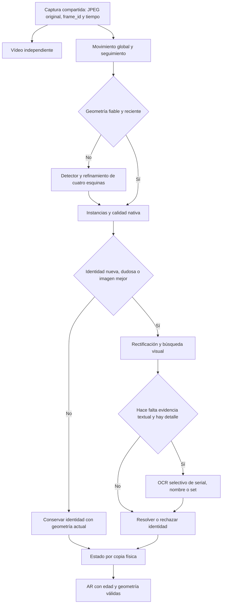

# Plan de mejora: reconocimiento con cámara variable y consultas eficientes

Actualización de ejecución: [TRANSFERENCIA_GENERAL.md](TRANSFERENCIA_GENERAL.md)
registra qué partes se implementaron y probaron, y qué sigue pendiente. El usuario
autorizó posteriormente el experimento de YOLO11 con cuatro esquinas; esa
autorización no ha desplegado sus pesos ni iniciado nuevos embeddings/dígitos.

Fecha: 25/09/2026. Este es el plan vigente para la siguiente etapa; sustituye
el supuesto de cámara fija del plan inicial. Es una propuesta de trabajo y
validación, no una afirmación de funcionalidades ya implementadas.

El desarrollo de nuevos vectores, entrenamiento e identificación especializada
de dígitos permanece pospuesto. Se incluye como etapa futura, sin iniciarlo por
este documento. Las mediciones de rendimiento definitivas se harán en la otra PC.

## 1. Diagnóstico y decisión principal

El piloto es una base útil, pero todavía no tenemos evidencia para llamarlo la
mejor solución para una cámara que cambia de posición. Repite identificación
visual en cada análisis, usa geometría aproximada y depende de suficientes
píxeles reales para OCR. Una consulta SQL más rápida no corrige esos problemas.

La arquitectura objetivo será **localizar y seguir cada copia física; reconocer
cuando aparezca, cambie o mejore su imagen; leer texto solo cuando aporte evidencia**.
El vídeo, la geometría, la identidad y la impresión tendrán estados y frecuencias
distintos. Una identidad estable no autoriza a mantener una posición AR obsoleta.

| Evidencia actual | Implicación |
|---|---|
| Detector ONNX: entrada 640×640 con letterbox; salida centro/tamaño/ángulo; hasta 20 candidatos | Detecta rectángulos orientados, no cuadriláteros proyectivos libres |
| Identificador: recorte cuadrado 224×224 y comparación 0/180 después de orientar el rectángulo | El giro arbitrario en imagen se trata aproximadamente con la caja; no significa que solo admita cartas verticales. Perspectiva y orden de esquinas siguen siendo riesgos |
| OCR: carta ampliada a 630×920, regiones inferiores fijas y hasta seis lecturas | Ampliar no añade detalle; un contorno incorrecto mueve la región del serial |
| Dos copias iguales existen en la mesa y el tracker usa proximidad | Mover la cámara puede parecer movimiento de todas las cartas o producir cambios de instancia |
| Original, CLAHE, DocSHRNet y MIMO aceptaron las mismas 4/7 cartas en una escena | No hay mejora demostrada que justifique restauración profunda permanente |
| Consulta real del OCR: mediana 0.66 ms; buscador general: 116–130 ms | Priorizar consultas del catálogo; el acceso al registro no explica por sí solo la lentitud visual |
| Búsqueda «Dragón»: 62 consultas para 30 filas; `LIKE '%texto%'` recorre nombres | Hay trabajo SQL y consultas por fila que podemos evitar antes de migrar lenguajes |

Los tiempos SQL son siete muestras con caché caliente y servicios activos, no
un benchmark entre lenguajes. La escena visual contiene siete instancias y seis
identidades, sin imagen limpia pareada. Fuentes locales:
[pipeline](PIPELINE_ESTADO.md), [reflejos](glare-benchmark/README.md),
[perfil SQL](qa/registry-query-profile.json), [cobertura](registry-coverage/README.md).

## 2. Qué significa cambiar la cámara

| Cambio | Riesgo | Respuesta propuesta |
|---|---|---|
| Traslación, altura o zoom | Escala diferente, menos píxeles del serial, asociaciones falsas | Redetectar, medir calidad nativa, reajustar seguimiento; invalidar geometría si hay salto |
| Inclinación respecto a la mesa | La carta pasa de rectángulo a trapecio | Obtener cuatro esquinas reales y rectificar con homografía |
| Giro de cámara/carta | Ambigüedad de arriba/abajo, serial en otra esquina de pantalla | Resolver orientación en coordenadas de carta y conservar la orientación física separada |
| Movimiento durante captura | Desenfoque y geometría atrasada | Elegir capturas más nítidas y retirar AR si no hay localización reciente |
| Cambio de lente, resolución, recorte o estabilización digital | Distorsión o calibración inválida | Versionar configuración; verificar o repetir calibración según el cambio |
| Mano levanta una carta | Ya no pertenece al plano de la mesa | Rectificar esa carta individualmente; no imponerle la homografía del tapete |
| Reflejo, funda o acabado foil | Pérdida de información o apariencia variable | Aprovechar otro instante/ángulo y evidencia parcial; no inventar un serial |
| Carta cortada, boca abajo u ocluida | Evidencia insuficiente o asociación ambigua | Estado desconocido/oculto; no confirmar identidad nueva sin evidencia |

**La esquina inferior izquierda debe ser la de la carta orientada correctamente,
no la de la imagen de cámara.** El recorte OCR actual ya intenta rectificar, pero
su precisión depende de que las esquinas y la orientación sean correctas.

Mover físicamente una cámara con lente/configuración iguales cambia su pose,
no necesariamente sus intrínsecos. Separar calibración de lente y pose de mesa.
OpenCV documenta la corrección de distorsión y la transformación de puntos de
un plano mediante homografía; eso fundamenta la propuesta geométrica, no garantiza
que podamos recuperar detalle de una vista casi de canto.
[Calibración](https://docs.opencv.org/4.13.0/dc/dbb/tutorial_py_calibration.html),
[homografía](https://docs.opencv.org/4.13.0/d9/dab/tutorial_homography.html).

## 3. Pipeline objetivo

Contrato por observación: `frame_id`, inicio de solicitud, recepción, inicio/fin
de inferencia, configuración de cámara, esquinas en imagen original, homografía,
orientación de carta, calidad, `track_id`, candidatos de `card_id`, posibles
`artwork_id` y evidencia OCR/impresión. No reutilizar coordenadas sin especificar
resolución, recorte y transformación. Guardar el origen de cada decisión.

### Geometría y orientación antes que filtros

1. Comparar tres variantes sobre las mismas capturas: caja orientada actual;
   refinamiento de bordes/cuadrilátero dentro de esa caja; detector de esquinas
   o segmentación disponible, si el refinamiento clásico no alcanza.
2. Rechazar quads degenerados, no convexos, recortados o sin apoyo suficiente
   en bordes. No forzar el formato de carta directamente sobre un trapecio sin
   considerar perspectiva. Medir error de esquinas y error de rectificación.
3. Conservar rectificación de carta en proporciones canónicas para geometría y
   OCR. Mantener por separado el preprocesado 224×224 que esperan los pesos
   existentes; cambiarlo exige comparar y regenerar el índice correspondiente.
4. Resolver arriba/abajo con evidencia de estructura, texto o reconocimiento.
   Probar las orientaciones necesarias cuando haya ambigüedad; no multiplicar
   siempre por cuatro el coste. Validar giros arbitrarios, horizontales y 180°.
5. Mantener dos conceptos: orientación canónica para leer y pose física para AR.
   No interpretar la posición de juego solamente a partir de la imagen enderezada.

### Seguimiento y planificación del trabajo

- Estado por instancia: `nueva → pendiente → identificada → perdida/ambigua`.
  Las transiciones requieren evidencia y tiempo, no solo un número de fotogramas.
- Seguimiento ligero entre detecciones completas; detección periódica también
  para descubrir cartas nuevas. Adelantarla ante movimiento global, pérdida de
  correspondencias, cambios grandes de escala o entrada/salida de objetos.
- Comparar compensación de movimiento del fondo y marcadores opcionales del
  tapete. Una homografía global de mesa no describe cartas levantadas ni todas
  las oclusiones; invalidar cuando la hipótesis de plano falle.
- Asociar geometría, apariencia y trayectoria con exclusión uno-a-uno. Ensayar
  cruces y dos cartas idénticas; ante asociación ambigua, perder el ID es preferible
  a transferir silenciosamente identidad y votos OCR entre copias.
- Conservar pocas capturas buenas por instancia: nitidez, detalle del ROI,
  perspectiva, oclusión y reflejo. La proporción de blanco actual es solo una
  señal, no una máscara fiable de brillos. No elegir oscuridad como «mejor» imagen.
- Recalcular identidad ante entrada, conflicto, cambio relevante o mejor captura;
  permitir verificaciones periódicas para detectar sustituciones de carta en
  la misma posición. No perpetuar una identificación antigua solo porque no se movió.
- OCR cuando pueda resolver ambigüedad o imprimir evidencia nueva. Presupuesto
  justo por instancia para que una carta difícil no monopolice el procesamiento.
  Un cache visual debe incluir imagen/versión de modelo; nunca reutilizar un
  serial entre observaciones distintas solo por compartir `track_id`.

### Identidad, arte, idioma e impresión

La primera respuesta debe ser identidad o desconocida. Arte, idioma y edición
son campos separados y pueden permanecer desconocidos. El set code es útil para
impresión e idioma cuando su lectura es fiable; no sustituye al serial ni demuestra
una rareza única. Preservar códigos con ceros iniciales y todos los resultados
de los seriales ambiguos; la auditoría encontró 13 seriales compartidos entre registros.

Usar evidencia visual para proponer candidatos y OCR exacto como evidencia
adicional. Si contradicen, conservar el conflicto; no transformar una similitud
visual en probabilidad ni sumar scores incompatibles sin calibración.
El deck puede priorizar búsqueda, pero debe existir salida «fuera del deck».

Revisar plantillas de monstruo clásico, Péndulo, Link, Magia, Trampa y Token.
La anatomía actual es una anotación aproximada de un monstruo clásico, no una
plantilla universal. Rush Duel mantiene alcance separado. Nombres oficiales
EN/ES/DE/FR/PT en la BD no equivalen a reconocimiento visual validado en esos idiomas.

## 4. Base de datos y elección de lenguaje

Primero mantener SQLite/Python y cambiar el patrón de consulta:

1. Rutas explícitas de serial, set, CID y nombre. En modo automático priorizar
   coincidencias exactas y conservar una búsqueda textual accesible: no cambiar
   silenciosamente el significado del buscador ni confundir IDs de imagen con seriales.
2. Sustituir las consultas por cada fila por obtención en lote de nombres y
   seriales de la página. Objetivo estructural: ≤5 sentencias por página de 30
   cartas, con la misma prioridad de fuentes y todos los idiomas requeridos.
3. Evitar ejecutar dos veces el mismo recorrido de nombres para conteo y página.
   Comparar materialización o consulta conjunta sin perder páginas vacías/totales.
4. Evaluar FTS5 y trigramas en una copia de prueba. Preservar semántica de
   subcadenas, acentos, guiones, apóstrofes, consultas cortas y comodines literales.
   FTS por palabras no equivale a `LIKE '%texto%'`; los trigramas tienen condiciones
   y límites que hay que probar. [FTS5](https://www.sqlite.org/fts5.html#the_trigram_tokenizer).
5. Confirmar índices mediante EXPLAIN QUERY PLAN antes y después. `LIKE` con
   comodín inicial no usa la optimización habitual de rango.
   [Optimizador SQLite](https://www.sqlite.org/optoverview.html#the_like_optimization).
6. Añadir una revisión de datos monotónica para invalidar cachés cuando el crawler
   incorpora información. No cachear indefinidamente búsquedas vacías. Medir
   concurrencia de lectores, escrituras y crecimiento WAL con conexiones cerradas.

Probar cambios de esquema en una copia coherente creada con la API de backup
de SQLite. No copiar solo el archivo principal mientras WAL está activo ni
reconstruir la base que Neuron escribe. Toda migración debe tener reversión y
actualizar el constructor para no perder índices al regenerar.

Go solo pasa a implementación si, tras optimizar SQL, el perfil demuestra coste
relevante del servicio o necesidad operativa de más clientes. Compararlo con la
misma base, versión/motor SQLite, consultas, resultados, caché y concurrencia;
incluir serialización y HTTP. La gestión de conexiones no elimina los scans.
[Conexiones en Go](https://go.dev/doc/database/manage-connections).
Julia queda como opción para experimentos numéricos específicos, no como primera
migración del registro. No introducir dos runtimes adicionales sin ganancia medida.

## 5. Capturas y conjunto de evaluación

Primera tanda: las siete cartas ya disponibles, incluyendo las dos copias de
Ojos Anómalos, más desconocidos, reversos y rectángulos que no sean cartas.
Grabar aproximadamente 12 situaciones × 3 sesiones × 15 s: unos nueve minutos
de vídeo antes de anotación. Es una muestra inicial; no demuestra cobertura general.

Situaciones: vista superior, dos inclinaciones oblicuas, lejos, cerca, giro de
cámara, giro de cartas, movimiento de cámara, movimiento de cartas, oclusión,
brillo/funda y cruce/sustitución de copias. Variar direcciones y distribución en
el cuadro; incluir bordes y esquinas. Muestrear varias condiciones combinadas,
sin exigir un producto cartesiano imposible de todas ellas.

Anotar identidad, copia física, cuatro esquinas visibles, arriba de carta,
visibilidad, movimiento, arte/idioma/rareza si están comprobados y legibilidad
humana del serial. La verdad del serial puede venir de una foto cercana, pero
eso no permite etiquetar como legible el mismo serial en una toma lejana.

Separar sesiones/dispositivos entre ajuste y evaluación. No contar cientos de
fotogramas vecinos como cientos de ejemplos independientes. Para ampliar al
piloto de 50 identidades, reservar al menos tres sesiones y distribuirlas entre
geometrías, artes y condiciones; añadir cartas físicas de los cinco idiomas según
disponibilidad. Reportar explícitamente estratos sin ejemplos.

## 6. Orden de ejecución y criterios de salida

| Prioridad | Trabajo | Dependencia | Criterio de salida |
|---|---|---|---|
| P0 | Congelar versiones, originales, decisiones y escenario de comparación | Estado actual | Reproducción local, hashes y resultados de referencia; respaldo coherente |
| P0 | Capturas con cámara variable y diagnóstico por etapa | Cartas y cámara | Clips/anotaciones separados por sesión; fallos clasificados por geometría, identidad y OCR |
| P1 | Esquinas reales, orientación y rectificación | P0 datos | Mejora medida de error geométrico y lectura en vistas oblicuas, sin aumento material de identidades falsas |
| P1 | Optimizar SQL y consultas por lote | Perfil SQL actual | Igualdad de resultados acordada, ≤5 consultas/página, mejora reproducible y crawler sin bloqueo |
| P1 | Propietario único de adquisición y `frame_id` en servidor | Instrumentación | Dos consumidores no duplican capturas del teléfono; reconexión y timestamps probados |
| P2 | Seguimiento, movimiento global y selección de mejores recortes | Geometría validada | Menos inferencias por carta estable; precisión conservada, sin trasladar votos entre copias |
| P2 | OCR selectivo y plantillas | P0/P1 geometría | Menos llamadas OCR, seriales exactos preservados y conflictos explícitos |
| P2 | Robustez del proceso de inferencia | Cola y métricas | Fallo nativo simulado no congela vídeo; reinicio controlado, colas acotadas y ninguna respuesta vieja aplicada |
| P3 | Benchmark CPU/GPU y opciones de batching/resolución | Otra PC y corpus fijo | Comparación calidad/coste/p95, sin elegir solo por FPS |
| P3 | Escalar galería, nuevos vectores o lector entrenado | Reactivar etapa pospuesta y datos suficientes | Mejora en sesiones/identidades reservadas, modelo versionado y retorno al anterior |
| P4 | Servicio Go o AR 3D | Necesidad demostrada | Beneficio medido o requisito concreto; no bloquear mejoras de geometría por esta migración |

P0 datos y P1 SQL pueden avanzar en paralelo lógico; no se requieren agentes
paralelos ni detener Neuron. Las duraciones de implementación no se fijan hasta
conocer hardware y disponibilidad de capturas. Cada etapa entrega comparación,
decisión y mecanismo de reversión, no solo código.

## 7. Cómo medir y decidir

| Área | Medidas |
|---|---|
| Captura | Intervalo real, JPEG completos, edad de imagen, reconexiones y bytes |
| Geometría | Detecciones omitidas/falsas, error de esquinas normalizado, éxito de orientación/rectificación |
| Identidad | Acierto top-1, aceptaciones correctas, falsas aceptaciones de desconocidos y abstenciones |
| Seguimiento | Cambios de ID, pérdidas, reidentificación y transferencia incorrecta entre copias |
| OCR | Coincidencia exacta de ocho dígitos sobre muestras legibles; ilegibles y ausentes por separado |
| Eficiencia | Detecciones/encodings/OCR por segundo y por carta estable, CPU/RAM/VRAM, tamaño de colas |
| Latencia | p50/p95 por etapa, tiempo a primera identidad y edad real del overlay |
| SQL | p50/p95 de endpoint y función, sentencias/página, planes, concurrencia y frescura |

Objetivos propuestos para ratificar tras el primer corpus: ≥95% de identificación
aceptada correcta en observaciones claramente visibles y ≤1% de falsas aceptaciones
en desconocidos, con denominadores e intervalos de incertidumbre por estrato.
No convertirlos en garantía ni extrapolar siete cartas a todo Yu-Gi-Oh!.

En rendimiento, primero conservar calidad y reducir trabajo redundante. Acordar
presupuesto de vídeo, primera identificación, recuperación de pose y búsqueda
con el hardware destino. El transporte actual solicita unos cinco JPEG/s por
pestaña: no prometer 25 FPS sin cambiar y validar la adquisición. No presentar
una mediana de SQL como latencia de cámara a pantalla.

Comparar incrementalmente: base → geometría → seguimiento → OCR selectivo →
preprocesamiento opcional. Registrar regresiones también. Si una variante solo
se ve más bonita o mejora PSNR pero no identidad/OCR, no entra al camino principal.
Mantener una opción de ejecución base para reversión y comparar sobre los mismos
frames originales. El seguimiento puede necesitar clips completos, no solo recortes.

## 8. Qué ya está hecho y no hay que repetir

- Vídeo separado de inferencia; cola OCR activa + último pendiente; rechazo de
  resultados obsoletos, reparto de lotes y omisión de OCR con texto muy pequeño.
- Menos repintados de canvas; coordinación de análisis entre pestañas del mismo
  origen/perfil; fechas de solicitud preservadas hasta OCR y resultado.
- Ranking de clasificación omitido cuando se usa solo el embedding; mismos
  vectores en ocho pruebas. Caché de sprites y composición por región con ocho
  comparaciones idénticas píxel a píxel.
- Registro multilingüe, fuentes y distinción de tipos de identificadores;
  auditoría de huecos. La descarga oficial sigue activa y tiene al menos una
  ficha portuguesa con timeout pendiente de reintento, no descartada como inexistente.
- Modelos/reflejos y guía de traslado guardados. Codebase Memory accesible por
  CLI; su conexión integrada y advertencias de frescura siguen documentadas.

Consultar [estado técnico](PIPELINE_ESTADO.md), [traslado](glare-benchmark/TRANSFERENCIA.md)
y [registro multilingüe](REGISTRO_MULTILINGUE.md). Este plan no activa entrenamiento,
cambia el detector ni migra servicios: define cómo probar y decidir esas acciones.
