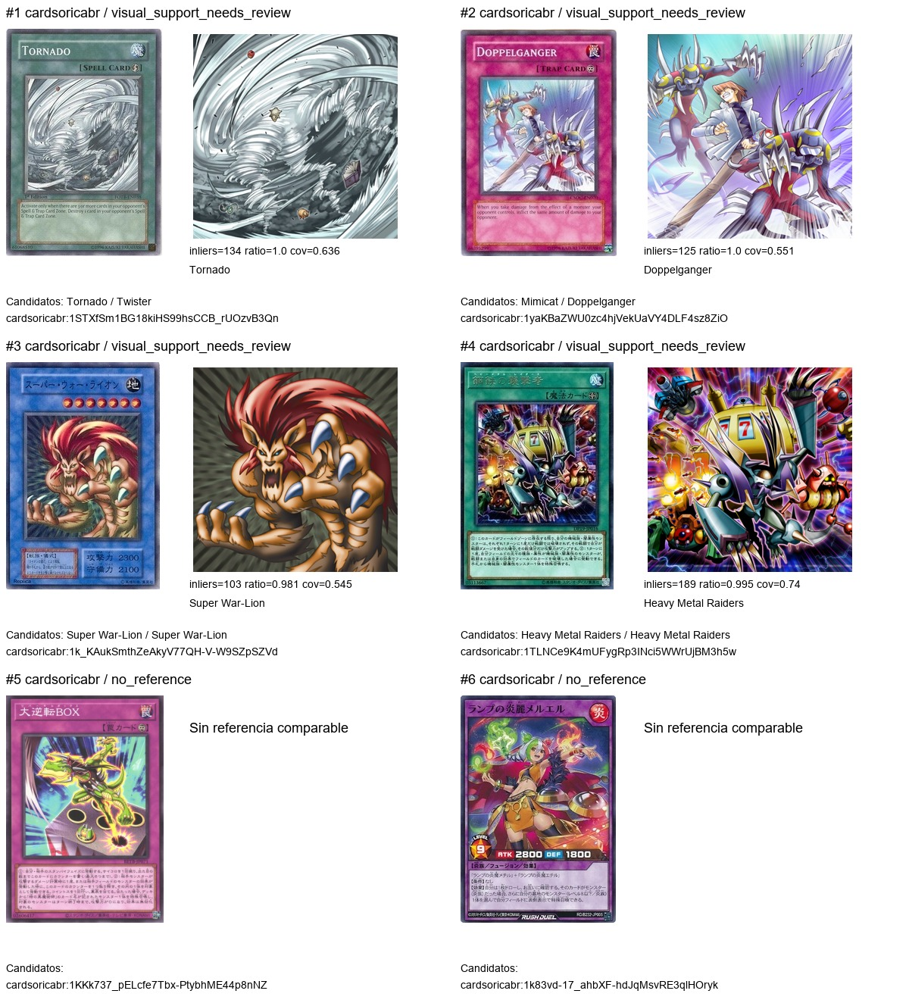
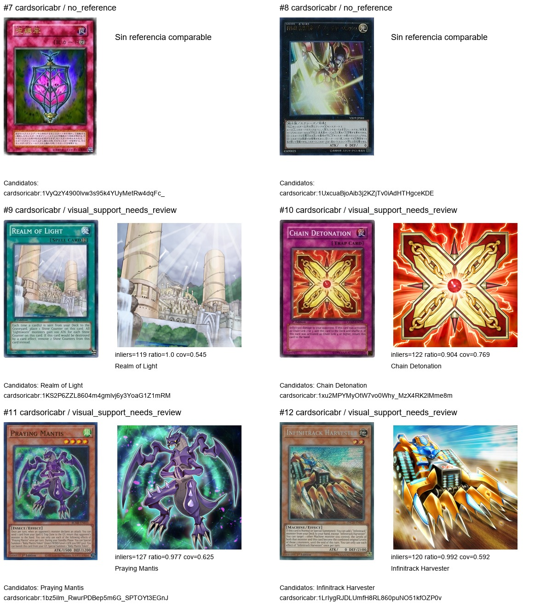
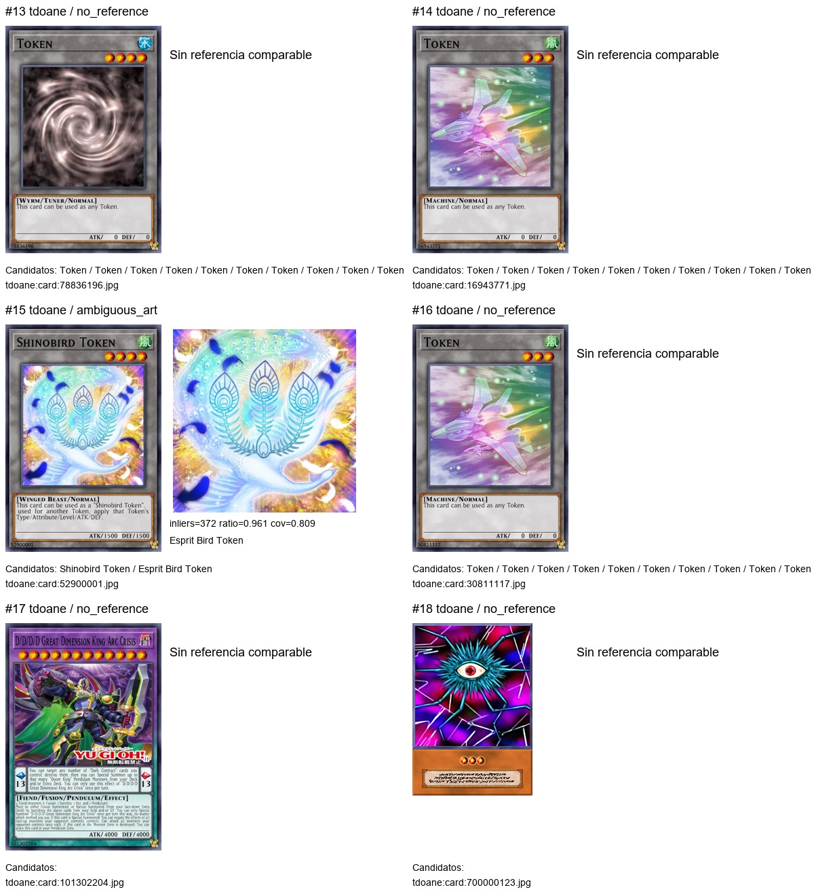
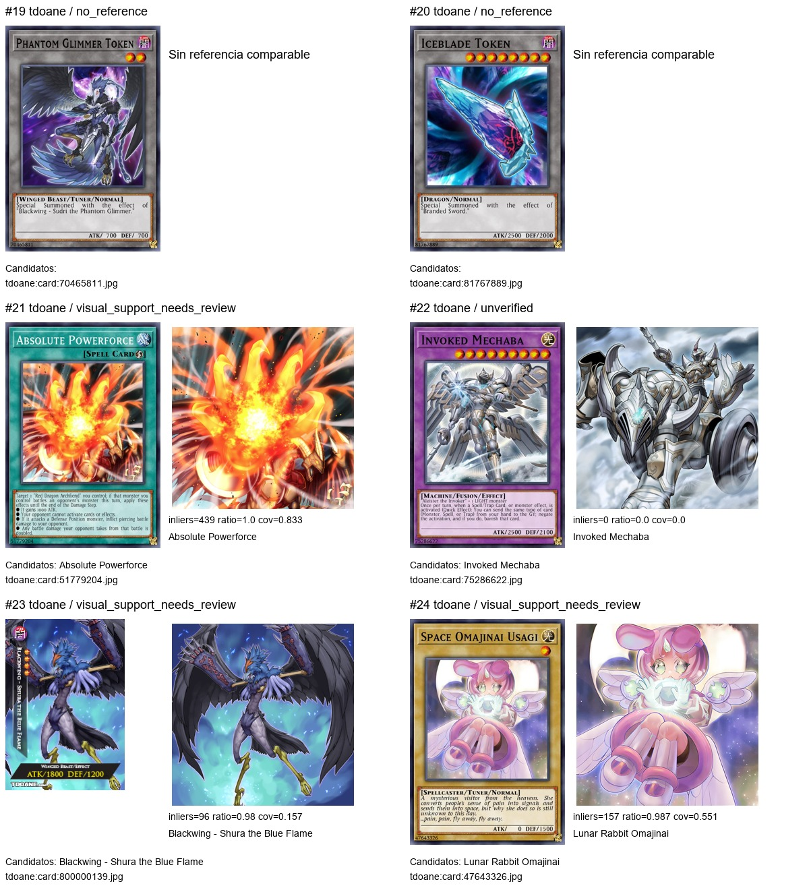

# Inspección visual de la muestra

Revisión realizada por el asistente sobre las cuatro láminas de comparación.
No es una anotación humana independiente ni una evaluación de cámara. Los
índices remiten a `results.json`, que conserva ref_id, SHA256, candidatos,
referencias y puntuaciones. No se modificaron decisiones del catálogo.

| Índice | Observación visual | Tratamiento |
|---|---|---|
| 1 | Tornado: nombre visible e ilustración coinciden con la referencia; la otra propuesta era Twister. | Apoyo a identidad e ilustración; impresión sin verificar. |
| 2 | Doppelganger: nombre e ilustración coinciden; la otra propuesta era Mimicat. | Apoyo a identidad e ilustración; impresión sin verificar. |
| 3 | Super War-Lion: ilustración coincidente, dos identidades candidatas con el mismo nombre. | Revisar los registros y formatos; no fusionarlos por arte. |
| 4 | Heavy Metal Raiders: ilustración coincidente, dos identidades candidatas con el mismo nombre. | Revisar los registros y formatos; no fusionarlos por arte. |
| 5 | Carta japonesa sin candidato en la cola. | Identidad pendiente; ausencia de candidato no implica carta inexistente. |
| 6 | Diseño con marca RUSH DUEL y distribución diferente de texto/estadísticas. | Etiquetar formato antes de aplicar geometría clásica. |
| 7 | Carta japonesa sin candidato en la cola. | Identidad pendiente. |
| 8 | Carta Xyz japonesa sin candidato; texto oscuro. | Investigar nombre/serial con imagen original; sin asignación. |
| 9 | Realm of Light: nombre e ilustración concordantes. | Apoyo visual; no verifica impresión. |
| 10 | Chain Detonation: nombre e ilustración concordantes. | Apoyo visual; no verifica impresión. |
| 11 | Praying Mantis: nombre e ilustración concordantes. | Apoyo visual; no verifica impresión. |
| 12 | Infinitrack Harvester: composición de la ilustración concordante pese a textura/brillo. | Apoyo visual; no inferir rareza del aspecto. |
| 13 | Token genérico del juego, numerosas propuestas llamadas Token y sin arte de referencia comparable. | No usar el nombre genérico como identidad. |
| 14 | Token con ilustración de nave; numerosas propuestas genéricas. | Mantener separado de otras imágenes Token. |
| 15 | Shinobird Token: ilustración coincide, pero varias referencias empatan entre Shinobird/Esprit Bird Token. | Mantener ambigüedad; revisar alias y formatos antes de elegir UUID. |
| 16 | Token de nave parecido al #14, con otro identificador impreso por el juego. | Conservar ambas referencias. Identidad pendiente. |
| 17 | D/D/D/D Great Dimension King Arc Crisis: diseño Pendulum, sin candidato en la cola. | Investigar registro y nombre; no clasificar como falso por ausencia. |
| 18 | Imagen con formato muy distinto de la carta clásica, ojo y texto japonés. | Diseño especial pendiente de clasificación; excluir de evaluación clásica hasta anotarlo. |
| 19 | Phantom Glimmer Token, sin candidato. | Revisar alias del juego y origen; no inventar passcode físico. |
| 20 | Iceblade Token, sin candidato. | Revisar alias del juego y origen; no inventar passcode físico. |
| 21 | Absolute Powerforce: nombre e ilustración concordantes. | Apoyo visual; impresión sin verificar. |
| 22 | El nombre visible es Invoked Mechaba. Su ilustración tiene una composición diferente de la referencia disponible; SIFT no encuentra soporte. | Ejemplo de posible arte alternativo: no convertir fallo visual en rechazo de identidad. No certifica que la imagen sea una impresión oficial. |
| 23 | Ilustración coincidente de Blackwing - Shura the Blue Flame, con marco y título lateral TDOANE. | Útil como variante de diseño del juego; no representa una impresión física estándar. |
| 24 | La ilustración coincide; el título del juego Space Omajinai Usagi difiere de Lunar Rabbit Omajinai en el catálogo. | Revisar alias/traducción; no añadir el título como nombre oficial automáticamente. |

Las 11 propuestas con apoyo geométrico muestran ilustraciones concordantes en
las láminas; el caso ambiguo #15 también muestra ilustración concordante.
Esto no mide exactitud de identidad, tasa de falsos positivos ni reconocimiento
bajo reflejos. La selección contiene cuatro referencias por grupo fuente/estado,
no una muestra representativa por idioma, rareza o condiciones físicas.

Los 13 controles uniformes no generaron coincidencias. Faltan negativos difíciles
con cartas reales parecidas y etiquetas independientes. No se bajaron umbrales
ni se promovieron asociaciones a partir de estas puntuaciones.

## Implicaciones para la base y el entrenamiento

1. Separar **formato** (clásico, Rush Duel, etc.) de **origen visual** (escaneo,
   render del juego, diseño personalizado). No inferir autenticidad por apariencia.
2. Mantener el arte como evidencia positiva; un arte desconocido no niega por sí
   solo una identidad confirmada por otros identificadores.
3. No usar diseños del juego como verdad de geometría para cartas físicas.
   Conservarlos y etiquetarlos permite evaluarlos por separado.
4. Revisar candidatos homónimos y tokens con metadatos antes de decidir UUID.
5. Elegir varios artes por identidad en el futuro índice, conservando todos
   los archivos. Aún no se recalcularon vectores ni cambió el visor.

## Láminas

